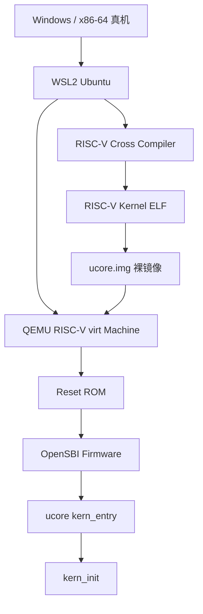
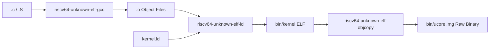
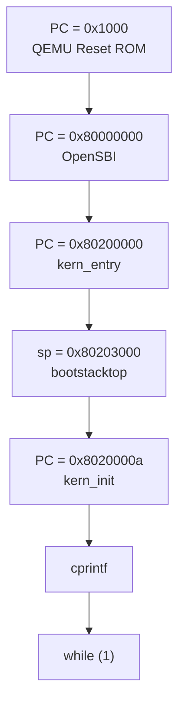
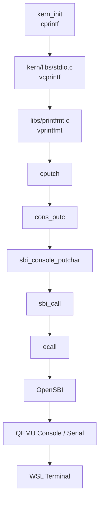
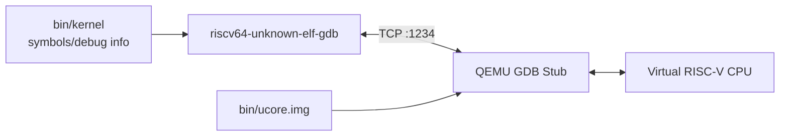
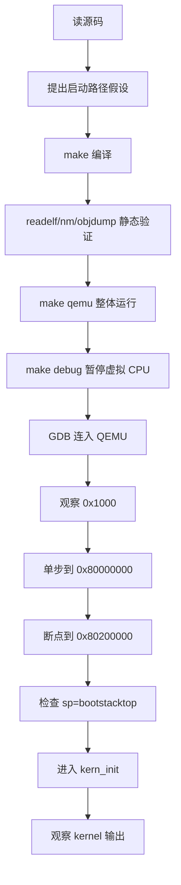
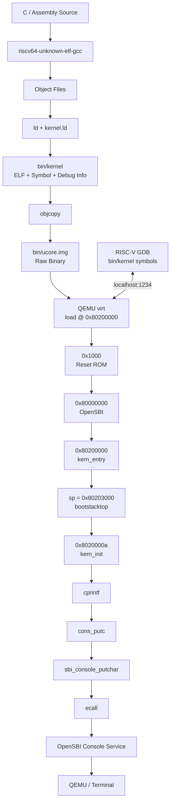

# Lab1 RISC-V 启动实验：任务、原理、代码结构与执行流程

> 本文基于当前仓库 `LIZZYGREAT/Operation-System-Labs` 的 `work/lab1/wenjie` 分支、Starter Code，以及已经实际得到的 `make / QEMU / GDB` 日志整理。  
> 目的不是重复实验报告，而是回答：**这次 Lab1 到底在做什么，为什么这样做，代码之间是什么关系，CPU 实际经历了什么。**

# 一、本次实验到底在做什么

## （一、）Lab1 不是“实现一个完整操作系统”

这次实验的重点不是实现进程、虚拟内存、调度器或文件系统，而是理解：

> **一份操作系统内核代码，怎样从源码变成 CPU 真正在执行的 RISC-V 指令，并完成最小启动。**

完整主线是：

```text
C / 汇编源码
        ↓
RISC-V 交叉编译
        ↓
ELF 内核
        ↓
裸二进制镜像
        ↓
QEMU 模拟 RISC-V 机器
        ↓
CPU Reset
        ↓
OpenSBI 固件
        ↓
进入我们自己的 kernel
        ↓
建立内核栈
        ↓
进入 C 函数 kern_init
        ↓
通过 SBI 输出字符串
```

所以 Lab1 可以概括为：

> **RISC-V 操作系统的最小启动实验。**

## （二、）本次实验真正要回答的四个问题

### （1.）我们的 x86 电脑为什么能运行 RISC-V 内核？

因为使用：

```text
RISC-V Cross Compiler
+
QEMU
```

交叉编译器负责：

```text
x86-64 Linux 上运行编译器
        ↓
生成 RISC-V 64 机器代码
```

QEMU 负责：

```text
在 x86-64 主机上
模拟一台 RISC-V 64 计算机
```

### （2.）CPU 上电后为什么不是直接执行 `kern_init()`？

因为：

```text
CPU Reset
≠
C 程序 main()
```

本实验的实际执行链是：

```text
0x1000
QEMU Reset ROM
        ↓
0x80000000
OpenSBI
        ↓
0x80200000
kern_entry
        ↓
0x8020000a
kern_init
```

### （3.）为什么一定要先执行 `kern_entry`？

因为进入 C 代码之前，至少需要准备好：

```text
stack
```

当前入口汇编：

```asm
kern_entry:
    la sp, bootstacktop
    tail kern_init
```

核心作用：

```text
先建立 kernel stack
        ↓
再进入 C 语言初始化函数
```

### （4.）GDB 在本实验中干什么？

GDB 主要用于：

> **观察 CPU 实际执行过程，验证我们对启动链的理解。**

实测：

```text
PC 初始 = 0x1000

执行 Reset ROM 后：
PC = 0x80000000

OpenSBI 运行后：
PC = 0x80200000

进入 kern_entry 后：
sp = 0x80203000

最终：
PC = kern_init = 0x8020000a
```

# 二、先建立整个实验系统的层次结构

## （一、）不要把 WSL、编译器、QEMU、OpenSBI、kernel 混在一起



## （二、）每一层分别负责什么

| 层次 | 本实验中的对象 | 作用 |
|---|---|---|
| Host 硬件 | x86-64 Windows PC | 真正运行所有软件 |
| Linux 开发环境 | WSL2 Ubuntu | 提供 GCC、make、QEMU、GDB 等 Linux 工具 |
| 交叉编译工具链 | `riscv64-unknown-elf-*` | 在 x86 主机上生成 RISC-V 程序 |
| 模拟硬件 | QEMU `virt` Machine | 模拟 RISC-V CPU、内存、串口等 |
| 固件 | OpenSBI | 介于机器与 OS kernel 之间，提供 SBI 服务并启动 kernel |
| OS 入口 | `kern_entry` | 建立 kernel 最基本执行环境 |
| OS C 入口 | `kern_init` | 执行当前 Lab 的内核初始化逻辑 |

# 三、源码怎样变成可以运行的 RISC-V 内核

## （一、）为什么不能直接使用普通 `gcc`

开发机器：

```text
Host ISA = x86-64
```

目标 CPU：

```text
Target ISA = RISC-V 64
```

普通：

```bash
gcc xxx.c
```

默认产生的是：

```text
x86-64 指令
```

所以必须使用：

```text
riscv64-unknown-elf-gcc
```

其中：

```text
riscv64
    目标体系结构是 64 位 RISC-V

unknown
    vendor 不重要

elf
    面向裸机/ELF 环境
```

## （二、）本次实际使用的工具链

当前实验已验证：

```text
riscv64-unknown-elf-gcc 10.2.0
riscv64-unknown-elf-gdb 10.1
QEMU 4.1.1
```

路径：

```text
~/os-lab/toolchain/current/bin/
~/os-lab/qemu/current/bin/
```

## （三、）`make` 实际完成什么

构建日志包括：

```text
+ cc kern/init/entry.S
+ cc kern/init/init.c
+ cc kern/libs/stdio.c
+ cc kern/driver/console.c
+ cc libs/printfmt.c
+ cc libs/readline.c
+ cc libs/sbi.c
+ cc libs/string.c
+ ld bin/kernel
riscv64-unknown-elf-objcopy ... bin/ucore.img
```

构建链：



# 四、为什么同时有 `bin/kernel` 和 `bin/ucore.img`

## （一、）`bin/kernel` 是 ELF 文件

实际检查：

```text
ELF 64-bit
RISC-V
statically linked
with debug_info
not stripped
```

ELF 除了机器指令，还包含：

```text
入口地址
Section
Symbol
Debug Information
源码与机器指令映射
```

因此 GDB 使用：

```gdb
file bin/kernel
```

这样才知道：

```text
kern_entry 在哪里
kern_init 在哪里
bootstacktop 在哪里
源码第几行对应哪条指令
```

## （二、）`bin/ucore.img` 是裸二进制

Makefile：

```makefile
$(OBJCOPY) $(kernel) --strip-all -O binary $@
```

即：

```text
ELF
↓
去掉 ELF 结构和调试元数据
↓
保留需要装入内存的字节
↓
Raw Binary
```

所以：

```text
bin/kernel
    主要给 linker / debugger / 分析工具使用

bin/ucore.img
    给 QEMU loader 直接放入内存
```

## （三、）为什么 GDB 不直接使用 `ucore.img`

raw binary 基本只有：

```text
一串字节
```

不会告诉 GDB：

```text
这个地址叫 kern_entry
这个地址对应 init.c:8
bootstacktop 是什么
```

因此本实验是：

```text
QEMU 实际执行：
bin/ucore.img

GDB 符号解释：
bin/kernel
```

# 五、链接脚本 `kernel.ld` 为什么重要

## （一、）什么是链接

多个 `.o`：

```text
entry.o
init.o
stdio.o
console.o
sbi.o
...
```

必须被组织成完整 kernel。

链接器需要决定：

```text
代码从什么地址开始
各 section 放在哪里
入口在哪里
各符号最终地址是多少
```

这些由：

```text
code/tools/kernel.ld
```

决定。

## （二、）本实验最关键配置

```ld
OUTPUT_ARCH(riscv)
ENTRY(kern_entry)

BASE_ADDRESS = 0x80200000;

SECTIONS
{
    . = BASE_ADDRESS;
```

含义：

```text
目标架构：RISC-V
ELF Entry：kern_entry
内核布局起点：0x80200000
```

所以：

```text
Entry point address = 0x80200000
kern_entry = 0x80200000
```

## （三、）Section 如何排列

大致是：

```text
0x80200000
│
├── .text
│
├── .rodata
│
├── ALIGN(0x1000)
│
├── .data
│
├── .sdata
│
├── edata
│
├── .bss
│
└── end
```

因此 `kernel.ld` 决定：

> **内核在内存中的整体布局。**

# 六、为什么 QEMU 也要把镜像加载到 `0x80200000`

## （一、）链接地址和加载地址要匹配

链接器认为：

```text
kern_entry = 0x80200000
```

QEMU Makefile：

```makefile
-device loader,file=$(UCOREIMG),addr=0x80200000
```

所以：

```text
Link-time Address
=
Load-time Address
=
0x80200000
```

## （二、）如果不一致会怎样

如果 ELF 认为内核在：

```text
0x80200000
```

实际却加载到：

```text
0x80400000
```

那么地址计算、跳转、全局数据访问都可能错。

因此：

> **链接地址和加载地址不是同一个概念，但本实验让它们保持一致。**

# 七、QEMU 启动后 CPU 从哪里开始执行

## （一、）错误直觉

错误想法：

```text
kernel 放在 0x80200000
→ CPU 一启动就执行 0x80200000
```

实际：

```text
初始 PC = 0x1000
```

## （二、）真实启动链



# 八、第一站：`0x1000`——QEMU Reset ROM

## （一、）为什么先到 `0x1000`

CPU 复位后必须有固定的最初执行位置。

当前 QEMU `virt` 实测：

```text
PC = 0x1000
```

这里不是我们的 kernel，而是 QEMU 为虚拟机器提供的最小复位启动代码。

## （二、）实际看到的五条指令

```text
0x1000: auipc t0,0x0
0x1004: addi  a1,t0,32
0x1008: csrr  a0,mhartid
0x100c: ld    t0,24(t0)
0x1010: jr    t0
```

执行五条后：

```text
PC = 0x80000000
```

逻辑上可理解为：

```text
Reset ROM
↓
取得当前 hart 信息和下一阶段入口
↓
读取跳转地址
↓
jr t0
↓
进入 firmware
```

## （三、）什么是 hart

RISC-V：

```text
hart = hardware thread
```

可理解为一个独立执行指令流的硬件线程/CPU execution context。

当前输出：

```text
Current Hart : 0
```

# 九、第二站：`0x80000000`——OpenSBI

## （一、）OpenSBI 是什么

SBI：

```text
Supervisor Binary Interface
```

可以先把 OpenSBI 理解成：

> **RISC-V 操作系统 kernel 与最底层 Machine Mode 之间的一层 firmware。**

常见 privilege mode：

```text
M-mode
Machine Mode
最高权限

S-mode
Supervisor Mode
OS kernel 常运行在这里

U-mode
User Mode
用户程序
```

OpenSBI 通常位于更底层的 M-mode，为 kernel 提供 SBI 服务。

## （二、）本实验中的证据

QEMU 输出：

```text
OpenSBI v0.4
Platform Name          : QEMU Virt Machine
Current Hart           : 0
Firmware Base          : 0x80000000
```

所以：

```text
0x80000000
```

就是当前 firmware 基址。

## （三、）OpenSBI 之后

GDB breakpoint 最终命中：

```text
0x80200000
kern_entry
```

因此当前 Lab 只需掌握：

```text
Reset ROM
↓
OpenSBI
↓
ucore kernel
```

# 十、第三站：`0x80200000`——`kern_entry`

## （一、）入口代码

`code/kern/init/entry.S`：

```asm
.section .text,"ax",%progbits
.globl kern_entry

kern_entry:
    la sp, bootstacktop

    tail kern_init
```

这是我们自己内核真正开始执行的位置。

## （二、）为什么不直接进入 `kern_init`

C 函数通常依赖 stack：

```text
函数调用
返回地址
局部变量
保存寄存器
```

所以 kernel 必须先准备自己的 stack。

# 十一、什么是 `sp` 和 stack

## （一、）`sp`

RISC-V：

```text
x2 = sp = stack pointer
```

## （二、）kernel stack 在哪里定义

`entry.S`：

```asm
.section .data

.align PGSHIFT
.global bootstack

bootstack:
    .space KSTACKSIZE

.global bootstacktop
bootstacktop:
```

## （三、）大小从哪里来

`code/kern/mm/mmu.h`：

```c
#define PGSIZE  4096
#define PGSHIFT 12
```

所以：

```text
Page Size = 2^12 = 4096 B = 4 KiB
```

`code/kern/mm/memlayout.h`：

```c
#define KSTACKPAGE 2
#define KSTACKSIZE (KSTACKPAGE * PGSIZE)
```

所以：

```text
KSTACKSIZE = 2 × 4096 = 8192 B = 8 KiB
```

## （四、）实际链接结果

```text
bootstack    = 0x80201000
bootstacktop = 0x80203000
```

差：

```text
0x2000 = 8192 B = 8 KiB
```

与源码一致。

## （五、）为什么使用 `bootstacktop`

常见 stack 向低地址增长，因此初始：

```text
sp = stack 高地址端
```

即：

```text
bootstacktop
```

# 十二、`la sp, bootstacktop` 为什么反汇编后不是一条指令

## （一、）`la` 是伪指令

源码：

```asm
la sp, bootstacktop
```

意思是：

```text
Load Address
把 bootstacktop 地址加载进 sp
```

最终可能展开成多条真实 RISC-V 指令。

## （二、）本次实际反汇编

```text
0x80200000: auipc sp,0x3
0x80200004: mv    sp,sp
```

执行第一条后：

```text
sp = 0x80203000
```

正好：

```text
bootstacktop = 0x80203000
```

当前低位 offset 为 0，链接优化后第二条显示成：

```asm
mv sp,sp
```

相当于 no-op。

但不能总结成：

> `la` 永远只靠一条 `auipc` 完成。

这是当前链接结果。

# 十三、`tail kern_init` 是什么

`tail` 也是伪指令。

表示：

```text
直接跳到 kern_init
不需要回到 kern_entry
```

本次反汇编：

```text
0x80200008: j 0x8020000a <kern_init>
```

# 十四、第四站：`kern_init`

## （一、）函数地址

实测：

```text
kern_init = 0x8020000a
```

注意：

```text
0x8020000a
```

只是当前这次编译/链接结果，不是 RISC-V 的固定规定。

## （二、）第一件事：处理 `[edata, end)`

代码：

```c
extern char edata[], end[];
memset(edata, 0, end - edata);
```

`edata`、`end` 来自：

```text
kernel.ld
```

链接脚本：

```ld
PROVIDE(edata = .);

.bss : {
    *(.bss)
    *(.bss.*)
    *(.sbss*)
}

PROVIDE(end = .);
```

设计意图：

```text
将未初始化数据区域清零
```

## （三、）当前 Lab1 的特殊情况

实测：

```text
edata = 0x80203008
end   = 0x80203008
```

所以：

```text
end - edata = 0
```

当前实际上没有真正清零任何字节。

这说明启动框架已经预留 BSS 初始化逻辑，只是当前最小 Lab1 没有形成需要清零的该段内容。

# 十五、最值得理解的调用链：`cprintf` 怎样打印到终端

源码：

```c
cprintf("%s

", message);
```

终端最终看到：

```text
(THU.CST) os is loading ...
```

这不是普通 Linux：

```text
printf → write syscall
```

因为我们此时就在 kernel 内。

完整调用链：



# 十六、逐层理解打印路径

## （一、）`cprintf`

`code/kern/libs/stdio.c`：

```c
int cprintf(const char *fmt, ...) {
    va_list ap;
    int cnt;
    va_start(ap, fmt);
    cnt = vcprintf(fmt, ap);
    va_end(ap);
    return cnt;
}
```

## （二、）`vprintfmt`

`code/libs/printfmt.c` 负责解析：

```text
%s
%d
%x
%p
...
```

## （三、）`cputch`

```c
static void cputch(int c, int *cnt) {
    cons_putc(c);
    (*cnt)++;
}
```

格式化后一个字符一个字符发送。

## （四、）`cons_putc`

`code/kern/driver/console.c`：

```c
void cons_putc(int c) {
    sbi_console_putchar((unsigned char)c);
}
```

## （五、）`sbi_console_putchar`

`code/libs/sbi.c`：

```c
void sbi_console_putchar(unsigned char ch) {
    sbi_call(SBI_CONSOLE_PUTCHAR, ch, 0, 0);
}
```

其中：

```c
SBI_CONSOLE_PUTCHAR = 1;
```

## （六、）`sbi_call`

```c
__asm__ volatile (
    "mv x17, %[sbi_type]
"
    "mv x10, %[arg0]
"
    ...
    "ecall
"
);
```

这里：

```text
x17 = a7
x10 = a0
```

然后执行：

```asm
ecall
```

## （七、）`ecall`

可以先理解为：

> **从当前软件层向更底层运行环境发起受控服务请求。**

所以：

```text
kernel
↓ ecall
OpenSBI
↓
console
↓
QEMU
↓
终端
```

# 十七、为什么打印完后进入死循环

代码：

```c
while (1)
    ;
```

不是 bug。

当前 Lab1 还没有：

```text
scheduler
process
shell
user program
```

所以最小 kernel 打印完后保持运行即可。

# 十八、为什么 `timeout 10s make qemu` 返回 124 仍算通过

kernel 最终永远循环，因此：

```bash
make qemu
```

不会主动退出。

自动测试用：

```bash
timeout 10s make qemu
```

10 秒后主动结束 QEMU，所以：

```text
exit code = 124
```

这里的通过标准不是 exit code 0，而是 timeout 前已经出现：

```text
OpenSBI
(THU.CST) os is loading ...
```

并且 QEMU 最终无残留进程。

# 十九、GDB 为什么能看到 QEMU 里的 CPU

普通 GDB 常调试本机程序。

这里程序运行在：

```text
QEMU 模拟的 RISC-V CPU
```

所以使用：

```text
GDB Remote Protocol
```

结构：



QEMU 知道虚拟 CPU 的：

```text
PC
Registers
Memory
Breakpoints
Single-step
```

GDB 通过 remote protocol 请求 QEMU读取或控制这些状态。

# 二十、`make debug` 与 `make gdb`

## （一、）`make debug`

比普通 `make qemu` 多：

```text
-s
-S
```

### `-s`

开启 QEMU GDB Server，默认监听：

```text
TCP 1234
```

### `-S`

启动后暂停 CPU。

因此 GDB 连接时仍能看到：

```text
PC = 0x1000
```

## （二、）`make gdb`

当前目标：

```makefile
riscv64-unknown-elf-gdb     -ex 'file bin/kernel'     -ex 'set arch riscv:rv64'     -ex 'target remote localhost:1234'
```

依次完成：

```text
启动 RISC-V GDB
↓
读取 bin/kernel 的符号和调试信息
↓
指定 rv64
↓
连接 QEMU
```

# 二十一、本实验中的关键 GDB 命令

## （一、）查看 PC

```gdb
p/x $pc
```

`pc` 是 Program Counter。

## （二、）查看当前机器指令

```gdb
x/10i $pc
```

## （三、）执行一条机器指令

```gdb
si
```

注意：

```text
si = 一条机器指令
```

不是一行 C/汇编源码。

## （四、）断点

```gdb
break kern_entry
```

或：

```gdb
break *0x80200000
```

## （五、）继续

```gdb
continue
```

# 二十二、本实验 GDB 实际证明了什么

| 阶段 | 实测 |
|---|---|
| 初始 | `PC=0x1000` |
| Reset ROM 后 | `PC=0x80000000` |
| `kern_entry` | `PC=0x80200000` |
| 进入 `kern_entry` 前 | `sp=0x8001bd80` |
| 设置内核栈后 | `sp=0x80203000` |
| `bootstacktop` | `0x80203000` |
| `kern_init` | `PC=0x8020000a` |

所以动态启动链是：

```text
0x1000
↓
0x80000000
↓
0x80200000
↓
sp = 0x80203000
↓
0x8020000a
```

# 二十三、`code/` 目录总体结构

```text
code/
├── Makefile
│
├── kern/
│   ├── init/
│   ├── driver/
│   ├── libs/
│   └── mm/
│
├── libs/
│
└── tools/
```

分层可先理解为：

```text
kern/
    kernel 本身的代码

libs/
    通用基础运行库

tools/
    构建系统文件
```

# 二十四、`code/Makefile`

Makefile 是构建总控制器，负责：

```text
选择编译器
设置编译参数
找到源码
生成 .o
链接 kernel
生成 raw image
启动 QEMU
启动 GDB
清理构建产物
```

关键工具：

```makefile
GCCPREFIX := riscv64-unknown-elf-

CC      := $(GCCPREFIX)gcc
LD      := $(GCCPREFIX)ld
OBJCOPY := $(GCCPREFIX)objcopy
OBJDUMP := $(GCCPREFIX)objdump
GDB     := $(GCCPREFIX)gdb
```

关键选项可以先认识：

```text
-g
    保留调试信息

-ffunction-sections
-fdata-sections
    让函数/数据尽量独立成 section

--gc-sections
    链接时删除最终未使用 section
```

因此：

> 工程中存在/被编译的函数，不代表当前 Lab1 都会实际执行。

# 二十五、`code/kern/init/`

这是本次最核心目录：

```text
kern/init/
├── entry.S
└── init.c
```

## （一、）`entry.S`

负责 kernel 最初的汇编入口：

```text
设置 boot stack
↓
跳入 C
```

同时定义：

```text
bootstack
bootstacktop
```

## （二、）`init.c`

负责最初 C 初始化：

```text
处理 data/BSS 边界
打印启动信息
无限循环
```

# 二十六、`code/kern/driver/`

```text
kern/driver/
├── console.c
└── console.h
```

用于抽象 kernel console。

核心：

```c
void cons_putc(int c) {
    sbi_console_putchar((unsigned char)c);
}
```

即：

```text
上层 kernel
↓
console abstraction
↓
SBI
```

当前还有：

```text
cons_getc
kbd_intr
serial_intr
cons_init
```

但 Lab1 主路径只做输出，没有实现/使用完整键盘、串口中断交互。

# 二十七、`code/kern/libs/`

当前：

```text
kern/libs/stdio.c
```

提供 kernel 高层 stdio：

```text
cprintf
vcprintf
cputchar
cputs
getchar
```

Lab1 核心路径：

```text
cprintf
↓
vcprintf
↓
vprintfmt
↓
cputch
↓
cons_putc
```

# 二十八、`code/kern/mm/`

当前：

```text
kern/mm/
├── memlayout.h
└── mmu.h
```

虽然叫 memory management，但 Lab1 还没有真正实现虚拟内存。

现在主要提供：

```text
页大小
页偏移
kernel stack 大小
```

`mmu.h`：

```c
#define PGSIZE  4096
#define PGSHIFT 12
```

`memlayout.h`：

```c
#define KSTACKPAGE 2
#define KSTACKSIZE (KSTACKPAGE * PGSIZE)
```

# 二十九、`code/libs/`

这是 kernel 的通用基础库，不是普通 glibc。

因为 kernel 使用：

```text
-nostdinc
-nostdlib
```

所以很多基础能力需要自己提供。

## （一、）`defs.h`

基础类型和宏：

```text
uint64_t
uintptr_t
size_t
bool
ROUNDUP
ROUNDDOWN
```

## （二、）`string.c / string.h`

实现：

```text
strlen
strcmp
memset
memcpy
memmove
memcmp
...
```

当前启动直接使用：

```c
memset(...)
```

## （三、）`stdio.h`

stdio 相关接口声明：

```text
cprintf
cputchar
readline
printfmt
...
```

## （四、）`stdarg.h`

用于变长参数：

```text
va_list
va_start
va_arg
```

例如：

```c
cprintf("%s %d", ...)
```

## （五、）`printfmt.c`

格式化字符串解析：

```text
%s
%d
%x
%p
%e
...
```

## （六、）`readline.c`

负责逐字符读取一行输入。

当前 `kern_init` 没调用它，所以：

```text
存在于通用库
≠
Lab1 启动时实际运行
```

## （七、）`sbi.c / sbi.h`

负责把 kernel 服务请求变成：

```text
SBI ecall
```

当前输出路径直接使用：

```text
sbi_console_putchar
```

## （八、）`riscv.h`

包含大量：

```text
RISC-V CSR 编号
状态位
异常原因
架构辅助宏
```

Lab1 不需要逐项学习。

后续做：

```text
trap
interrupt
timer
CSR
```

时会更重要。

## （九、）`error.h`

定义：

```text
E_INVAL
E_NO_MEM
E_FAULT
...
```

主要供通用错误处理/格式化使用，当前启动主线不重要。

# 三十、`code/tools/`

```text
tools/
├── function.mk
└── kernel.ld
```

## （一、）`function.mk`

Makefile 辅助函数库，用于：

```text
扫描源码
生成 .o/.d 路径
生成编译规则
创建 target
创建目录
```

它不是 kernel 运行时代码。

## （二、）`kernel.ld`

链接脚本，负责：

```text
kernel entry
kernel base address
section 布局
edata/end 等符号
```

它不作为普通程序执行，但决定程序最终内存布局。

# 三十一、一定要区分“仓库里存在”和“本次实际执行”

当前真正主路径很短：

```text
Reset ROM
↓
OpenSBI
↓
kern_entry
↓
kern_init
↓
cprintf
↓
vcprintf
↓
vprintfmt
↓
cputch
↓
cons_putc
↓
sbi_console_putchar
↓
sbi_call
↓
ecall
↓
OpenSBI
↓
QEMU console
```

仓库里还有：

```text
readline
getchar
大量 string functions
error formatting
大量 RISC-V CSR definitions
```

它们主要是通用框架/后续 Lab 准备，不等于当前启动路径都执行。

# 三十二、为什么代码这么少仍然是 kernel

kernel 的本质不是代码多，而是：

```text
CPU 已经把控制权交给它
它运行在操作系统所在执行层次
它不依赖另一个普通用户态 OS 来运行
```

当前 Lab1 是：

```text
minimal kernel
```

只实现：

```text
最小启动
最小 console 输出
```

后续才会加入：

```text
trap
interrupt
memory management
process
scheduler
system call
filesystem
```

# 三十三、本次完整执行流程如何理解



## （一、）读源码

先读：

```text
Makefile
tools/kernel.ld
kern/init/entry.S
kern/init/init.c
```

先提出假设：

```text
kernel 应加载在 0x80200000
入口应该是 kern_entry
kern_entry 应设置 stack
然后进入 kern_init
kern_init 应打印启动信息
```

## （二、）`make`

```bash
make clean
make
```

证明：

```text
工具链能编译
链接成功
raw image 能生成
```

## （三、）静态检查

```bash
file bin/kernel
riscv64-unknown-elf-readelf -h bin/kernel
riscv64-unknown-elf-nm -n bin/kernel
riscv64-unknown-elf-objdump -d bin/kernel
```

得到：

```text
ELF = RISC-V
Entry = 0x80200000
kern_entry = 0x80200000
kern_init = 0x8020000a
bootstacktop = 0x80203000
```

## （四、）普通 QEMU

```bash
make qemu
```

证明：

```text
OpenSBI
↓
kernel
↓
(THU.CST) os is loading ...
```

整条链能运行。

## （五、）QEMU + GDB

两个进程：

```text
QEMU
    模拟并暂停机器

GDB
    控制和观察虚拟 CPU
```

通过：

```text
localhost:1234
```

通信。

# 三十四、为什么静态验证和动态 GDB 都需要

静态工具证明：

```text
“ELF 里 kern_entry 的地址是 0x80200000”
```

GDB 证明：

```text
“CPU 实际运行时真的进入 0x80200000”
```

所以证据链是：

```text
kernel.ld
↓
ELF Symbol
↓
QEMU Loader
↓
GDB Runtime PC
```

# 三十五、本次最重要的五个地址

| 地址 | 含义 | 是否固定 |
|---|---|---|
| `0x1000` | 当前 QEMU virt Reset ROM | 当前平台启动布局 |
| `0x80000000` | 当前 OpenSBI Firmware Base | 当前 firmware 布局 |
| `0x80200000` | 本实验 kernel base / entry / `kern_entry` | 本实验明确配置 |
| `0x8020000a` | 当前构建的 `kern_init` | 当前编译结果，可变化 |
| `0x80203000` | 当前 `bootstacktop` | 当前链接结果，可变化 |

尤其不要把：

```text
kern_init = 0x8020000a
```

背成体系结构规定。

# 三十六、仓库根目录各部分

```text
Operation-System-Labs/
├── README.md
├── code/
└── report/
```

## （一、）`code/`

Starter Code 和实验程序。

## （二、）`report/`

交付材料：

```text
report.md
    最终报告

prompt.md
    AI Prompt 记录

images/
    真实实验截图

_work/
    当前开发分支的执行日志和调试证据
```

`_work/` 属于开发/审计过程材料，不是 kernel 代码。

# 三十七、你现在复盘时建议的顺序

## （一、）先看 `kernel.ld`

回答：

```text
kernel 为什么是 0x80200000？
```

## （二、）看 `entry.S`

回答：

```text
kernel 第一件事做什么？
为什么？
```

## （三、）看 `init.c`

回答：

```text
进入 C 后做什么？
```

## （四、）沿 `cprintf` 一路追进去

```text
cprintf
→ vcprintf
→ vprintfmt
→ cons_putc
→ sbi_console_putchar
→ sbi_call
→ ecall
```

## （五、）看 Makefile 的 `qemu/debug/gdb`

回答：

```text
QEMU 如何加载 kernel？
GDB 如何连接 QEMU？
```

## （六、）自己重新跑一次 GDB

核心命令：

```gdb
p/x $pc
x/5i $pc

si
si
si
si
si

p/x $pc

break kern_entry
continue

p/x $sp
si
p/x $sp

break kern_init
continue
```

如果每一步都能解释“我为什么执行它、我想验证什么”，Lab1 就基本真正理解了。

# 三十八、你最终应该能自己讲出的完整故事

> 我的电脑是 x86-64，但课程 kernel 是 RISC-V，所以先在 WSL 中用 `riscv64-unknown-elf-gcc` 交叉编译。多个目标文件通过 `kernel.ld` 链接成 ELF，其中 `kern_entry` 被放在 `0x80200000`，随后 `objcopy` 生成裸的 `ucore.img`。
>
> QEMU 模拟一台 RISC-V virt 机器，并把 `ucore.img` 加载到 `0x80200000`。但是 CPU reset 后并不会直接进入 kernel，而是先从 QEMU 的 reset ROM `0x1000` 执行，再跳到位于 `0x80000000` 的 OpenSBI。OpenSBI 完成 firmware 阶段后，把执行流交给 `0x80200000` 的 `kern_entry`。
>
> `kern_entry` 先把 `sp` 设置为 kernel 自己的 `bootstacktop`，当前实际是 `0x80203000`，然后跳转到 `kern_init`。`kern_init` 做最小初始化，并通过 `cprintf → console → SBI → ecall → OpenSBI → QEMU` 把启动字符串输出到终端，最后进入无限循环。
>
> 调试时，QEMU 的 `-s -S` 开启 GDB stub 并暂停 CPU，RISC-V GDB 读取 `bin/kernel` 中的符号信息，通过 `localhost:1234` 操作 QEMU 中的虚拟 CPU。因此我们能真正观察到 `0x1000 → 0x80000000 → 0x80200000`，而不是只根据源码推断。

# 三十九、本次暂时不用深入的内容

目前不用展开：

```text
完整 RISC-V CSR 表
页表
虚拟地址转换
trap
interrupt
timer interrupt
进程调度
用户态
system call
文件系统
完整 OpenSBI 源码
完整 QEMU 设备模型
```

当前重点：

```text
Build
↓
Load
↓
Boot
↓
Firmware
↓
Kernel Entry
↓
Stack
↓
C Initialization
↓
Console Output
↓
GDB Verification
```

# 四十、复习检查清单

- [ ] 为什么普通 `gcc` 不行，要 `riscv64-unknown-elf-gcc`？
- [ ] QEMU 模拟的是程序还是一整台 RISC-V 机器？
- [ ] `bin/kernel` 和 `bin/ucore.img` 区别是什么？
- [ ] 为什么 GDB 用 ELF，而 QEMU loader 用 raw image？
- [ ] `kernel.ld` 负责什么？
- [ ] 为什么链接地址和加载地址都为 `0x80200000`？
- [ ] `0x1000` 是什么？
- [ ] `0x80000000` 是什么？
- [ ] `0x80200000` 是什么？
- [ ] OpenSBI 在 kernel 前面做什么？
- [ ] `kern_entry` 为什么先设置 `sp`？
- [ ] 当前 kernel stack 多大？
- [ ] `bootstack` 和 `bootstacktop` 是什么？
- [ ] 为什么 `la` 反汇编后不是一条 `la`？
- [ ] `tail kern_init` 为什么变成跳转？
- [ ] `edata` 和 `end` 从哪里来？
- [ ] 为什么当前 `edata == end`？
- [ ] `cprintf` 最后怎样经过 SBI 输出到终端？
- [ ] `ecall` 在其中是什么角色？
- [ ] 为什么无限循环不是 bug？
- [ ] 为什么 timeout 返回 124 仍可判定成功？
- [ ] `-s` 和 `-S` 区别是什么？
- [ ] GDB 怎样控制 QEMU 中的虚拟 RISC-V CPU？
- [ ] `readelf/nm` 和 GDB 分别证明什么？

# 四十一、整份 Lab1 的核心图



这张图就是本次 Lab1 的整体知识结构。
