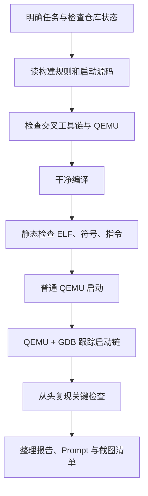

# Lab1 学习笔记

> 用途：把和 Lab1 学习有关的关键讲解整理成可反复阅读的笔记。后续每次讲完一个重要流程或知识点，再按主题追加。

## 1. 我们面对的任务是什么

Lab1 的核心是理解并验证 RISC-V 内核怎样从源码变成可执行镜像，并经过虚拟机固件进入内核。当前实验不是实现完整操作系统，也不要求在本阶段增加进程、内存管理或文件系统功能。

需要讲清楚并能用证据说明的主线是：

```text
源码
  → RISC-V 交叉编译与链接
  → ELF 内核和裸镜像
  → QEMU 模拟的 RISC-V virt 机器
  → Reset ROM（本次观测地址 0x1000）
  → OpenSBI（本次观测入口 0x80000000）
  → ucore 的 kern_entry（0x80200000）
  → 设置内核栈
  → kern_init
  → 按 edata..end 清零并输出启动信息
```

学习时要区分三类结论：

1. **源码表达的意图**：例如入口汇编准备栈后跳进 C 初始化函数。
2. **静态产物给出的证据**：例如 ELF 入口、符号地址和反汇编指令。
3. **运行时实际观测**：例如 GDB 中的 PC、SP，以及 QEMU 串口输出。

三类证据能互相对应，才能说明我们理解了启动过程，而不是只记住一串地址。

## 2. 整体流程地图



### 阶段 A：明确任务和仓库状态

先确认项目目录、当前分支、工作区状态和现有记录，知道正在学习哪份代码，也避免把旧文件误认为刚产生的内容。

**前置知识：** Git 用来记录文件版本；分支是同一仓库中并行维护的一条版本线；`git status` 用来区分已提交内容与本地改动。当前项目仓库在 `Operation-System-Labs/`，当前分支是 `work/lab1/wenjie`。

### 阶段 B：从代码建立启动路径

按职责读四个入口文件：

- `code/Makefile`：如何编译、链接、生成镜像和启动 QEMU/GDB。
- `code/tools/kernel.ld`：内核从哪个地址布局，ELF 入口符号是谁。
- `code/kern/init/entry.S`：内核开始执行时先做什么。
- `code/kern/init/init.c`：进入 C 后的最初初始化行为。

**前置知识：** Makefile 描述构建规则；链接脚本安排程序段和符号地址；汇编可以在 C 环境尚未准备好时直接设置寄存器；C 初始化代码运行前需要可用的栈。

当前实现的 `kern_init` 会调用 `memset(edata, 0, end - edata)`。已有静态检查记录显示本次构建中 `edata` 与 `end` 都是 `0x80203008`，所以清零区间长度为零；学习时要把“代码写了清零逻辑”和“本次实际清了多少字节”区分开。

这一阶段形成的是“待验证的解释”，不能把它当成已经发生的运行结果。

### 阶段 C：确认实验工具环境

核对 `make`、RISC-V 交叉编译器、RISC-V GDB 和 QEMU 是否可用、版本是否符合当前实验记录。

**前置知识：** 主机是 x86_64，而目标程序是 RISC-V；交叉编译器运行在主机上，却生成另一种 CPU 架构的机器码。QEMU 在主机上模拟 RISC-V 机器。工具版本和 PATH 会影响构建、运行与调试结果。

### 阶段 D：干净构建

先移除旧的生成物，再执行构建，确认当前源码能够从头产生内核文件。

**前置知识：** 编译通常先把源文件变成目标文件，再由链接器合成 ELF。清理后重建可以排除旧目标文件造成的假成功。

### 阶段 E：静态检查构建结果

使用 `readelf` 看 ELF 信息，`nm` 查符号地址，`objdump` 看入口附近的机器指令。重点确认入口是否位于 `0x80200000`，并理解 `kern_entry`、`kern_init` 和 `bootstacktop` 的地址关系。

**前置知识：** ELF 是带有段、入口和符号等信息的可执行文件格式；`ucore.img` 是去掉 ELF 外壳后供加载器使用的裸镜像；反汇编把机器码显示为汇编指令。静态检查说明“产物是什么”，但不能单独证明 CPU 实际执行了它。

### 阶段 F：普通 QEMU 运行

启动模拟机器，确认固件和内核能够运行，并从串口看到内核启动消息。

**前置知识：** `-machine virt` 选择模拟的 RISC-V 平台，`-bios default` 使用默认固件，loader 将镜像放到指定内存地址，`-nographic` 把串口显示在终端。内核目前会进入无限循环，因此运行不自动退出不等于启动失败。

### 阶段 G：QEMU 与 GDB 联合跟踪

让 QEMU 在 CPU 执行前暂停并开放 GDB 连接，再让 GDB 观察 PC、断点和寄存器，验证 `0x1000 → 0x80000000 → 0x80200000 → kern_entry → kern_init`，并检查 `sp` 是否切换到 `bootstacktop`。

**前置知识：** PC 保存当前执行位置，SP 是栈指针；断点让执行在指定地址或符号停下，单步用于逐条推进。QEMU 提供远程调试端，GDB 连接该端并读取 ELF 符号。`-s` 开启调试端口，`-S` 让 CPU 启动时暂停。

### 阶段 H：关键流程复现

再从清理和构建开始重复关键验证，确认观察结果稳定、可复现。

**前置知识：** 一次成功可能受旧产物、进程状态或环境影响；重复实验可以检查结论是否依赖偶然条件。每次都应区分预期的持续运行与真正的故障。

### 阶段 I：整理交付记录

把有证据支持的结果写进实验报告，把真实用户提示词写进 `report/prompt.md`，列明仍需本人补充的个人信息和真实截图。

**前置知识：** 报告是实验结论的解释，执行日志是详细证据索引，Prompt 文件记录实际收到的任务提示。它们用途不同，不应互相替代；截图只能来自真实实验画面。

## 3. 当前进度与本轮学习范围

仓库已有执行日志和实验报告，记录显示干净构建、静态检查、QEMU 启动和 GDB 启动链跟踪此前都已完成。用户现在选择亲自按流程复现；当前从工具环境核对开始，之后依次重建、静态检查、运行 QEMU 并跟踪 GDB。

报告仍列有组员信息和真实终端截图待补；`tools/grade.sh` 不存在，因此现有记录没有把 `make grade` 当作有效验收。

## 4. 后续交互约定

每当开始讲解一个具体流程，我会先说明该流程要解决什么问题，再讲清所需前置知识，之后结合本项目文件或已有运行记录解释结果。每次回答形成了值得复习的重点，就把要点追加到本笔记；`report/prompt.md` 只保存用户关于本项目流程与学习的提示词原文。

## 5. 第一阶段：确认仓库基线

### 这一阶段要做什么

先确认终端所在目录、当前 Git 分支、工作区改动和最近一次提交。这样后续读代码或运行构建时，我们知道操作对象和起点，也能区分原有内容与本次学习记录。

### 前置知识

- **工作目录**：终端命令默认在当前目录中查找文件；`cd` 切换目录，`pwd` 显示当前目录。
- **Git 分支**：当前分支决定我们正在查看哪条代码历史；查询分支不会切换分支。
- **工作区状态**：`git status` 会标出已修改但未提交的文件（`M`）和 Git 尚未跟踪的新文件（`??`）。这两类状态都可能是预期的本地工作。
- **提交记录**：`git log -1` 显示最近一次提交，帮助确定当前代码的版本起点。

### 逐条执行

以下第一条命令假设新终端从工作区根目录 `workspace/` 打开。请按顺序运行，并把完整输出发来：

```bash
cd Operation-System-Labs
```

**作用：** 进入实际 Git 仓库。工作区根目录本身不是 Git 仓库。

```bash
pwd
```

**作用：** 显示当前目录，确认上一条命令进入了 `Operation-System-Labs`。

```bash
git branch --show-current
```

**作用：** 只读出当前分支名，不会切换分支。当前共享工作区预期显示 `work/lab1/wenjie`。

```bash
git status --short --branch
```

**作用：** 同时查看分支和本地文件状态。当前预期会显示 `report/prompt.md` 已修改、`report/_work/Lab1_学习笔记.md` 是新文件；这些是本轮学习记录。

```bash
git log -1 --oneline
```

**作用：** 查看当前 HEAD 指向的最近一次提交，确认代码历史起点。当前共享工作区预期显示提交 `ea10144 feat: add logs`。

```bash
git diff -- report/prompt.md
```

**作用：** 查看已跟踪的 Prompt 文件具体改动，确认它只保留项目流程相关提示词。

```bash
sed -n '1,180p' report/_work/Lab1_学习笔记.md
```

**作用：** 查看新建的学习笔记内容。新文件不会出现在 `git diff` 的普通差异里，所以用 `sed` 直接阅读。

### 阶段判断

这一阶段只观察和理解，不运行会改变代码或清理文件的命令。确认目录、分支和文件状态与预期相符后，我们就知道了学习工作的准确起点；下一阶段再梳理四个核心源码文件之间的关系。

### 命令执行环境补充

本次终端界面每次提交命令都会启动独立 shell，因此一次调用中的 `cd` 不会影响下一次调用。用户在工作区根目录运行 Git 命令时得到“不是 Git 仓库”；单独运行 `cd` 成功后，下一次 `pwd` 又显示工作区根目录。这是命令会话彼此独立的结果。后续相对路径命令默认以项目仓库根目录为起点；若当前终端不在仓库根目录，需要在同一次 shell 调用中先切换目录再运行目标命令。

## 6. 第二阶段：阅读启动相关源码

### 这一阶段要做什么

阅读构建规则、链接脚本、汇编入口和 C 初始化函数，先画出“镜像如何生成、内核从哪里开始、入口做了什么”的源码级路径。此时建立的是待验证的理解；实际地址和执行顺序还要结合后续构建产物、QEMU 和 GDB 证据。

### 前置知识

- **Makefile** 是构建说明，目标（target）描述要生成或执行什么，变量保存工具名和参数，依赖关系决定先后顺序。
- **链接脚本**告诉链接器程序段与符号的内存布局；`ENTRY(...)` 指定 ELF 的入口符号。
- **汇编入口**在 C 初始化环境尚未完整建立时直接操作 CPU 寄存器。本项目的 `.S` 文件还会经过 C 预处理，因此可以包含头文件和宏。
- **C 初始化函数**负责内核最早期的 C 逻辑；这里要留意它依赖的栈、内存区间和输出接口。

### 逐条查看

以下相对路径命令都以 `Operation-System-Labs/` 仓库根目录为起点。新终端若打开在其他目录，先在该终端进入仓库根目录，再运行命令。

```bash
sed -n '1,240p' code/Makefile
```

**作用：** 展示构建规则。先找交叉编译器前缀和 QEMU 名称，再看 ELF 内核、裸镜像如何生成，以及 `qemu`、`debug`、`gdb` 目标分别执行什么。

```bash
cat code/tools/kernel.ld
```

**作用：** 查看链接布局。重点找 `ENTRY(kern_entry)` 和 `BASE_ADDRESS`，理解链接器把内核入口安排在哪里。

```bash
cat code/kern/init/entry.S
```

**作用：** 查看内核第一段汇编。重点看 `kern_entry`、设置 `sp` 的指令、跳往 `kern_init` 的指令，以及 `bootstack` / `bootstacktop` 的定义。

```bash
cat code/kern/init/init.c
```

**作用：** 查看进入 C 代码后的早期逻辑。重点看 `edata` 到 `end` 的清零调用、启动信息输出，以及函数为何不会正常返回。

### 阅读时要连起来的问题

1. Makefile 把哪个文件交给 QEMU 加载？加载地址是什么？
2. 链接脚本规定的内核入口地址是否与加载地址相同？
3. QEMU 使用固件时，CPU 为什么还要经过固件才能到达内核入口？
4. `kern_entry` 为什么先设置 `sp`，再进入 C 函数？
5. `kern_init` 输出启动信息后为什么持续运行？

这一阶段完成后，我们应能提出启动路径假设，但暂不把它当成运行事实。下一阶段才检查编译器、QEMU 等工具是否可用，然后通过实际构建和静态检查验证地址与镜像。

## 7. 核心代码解析：四个文件如何串成启动链

### 7.1 全局先看一遍

```text
Makefile
  ├─ 调用 RISC-V 编译器和链接器
  ├─ 用 kernel.ld 生成 bin/kernel（保留 ELF 符号）
  ├─ 转成 bin/ucore.img（供 QEMU loader 装入）
  └─ 启动 QEMU；调试时让 GDB 连接 QEMU

QEMU virt + OpenSBI
  └─ 把控制权交给 0x80200000 的 kern_entry
       ├─ entry.S：设置内核栈 sp
       └─ 跳到 init.c 的 kern_init
            ├─ 按 edata..end 清零
            └─ cprintf 输出启动消息
```

可以先用一句话记住四个文件的职责：**Makefile 组织工具，kernel.ld 安排地址，entry.S 建立最小执行环境，init.c 开始执行内核 C 逻辑。**

### 7.2 Makefile：构建、镜像和调试入口

下列行号对应本次阅读的 `code/Makefile`。

#### 工具选择和编译选项（第 1–41 行）

- **第 1 行 `PROJ := lab1`**：保存实验编号，后面打包 handin 文件名时会用到。
- **第 2–4 行 `EMPTY`、`SPACE`、`SLASH`**：构造空格和路径分隔符，供 Make 函数拼接字符串。
- **第 6 行 `V := @`**：Make 执行配方时，`@` 会隐藏命令本身，只显示配方主动打印的提示；调试时可用 `make V=` 显示完整命令。
- **第 8–10 行**：`#ifndef` 和 `#endif` 前面有 `#`，在 Makefile 中是注释，不是条件语句。实际生效的是第 9 行的 `GCCPREFIX := riscv64-unknown-elf-`。它让 `gcc`、`ld`、`objcopy` 等命令使用 RISC-V bare-metal 工具链前缀。
- **第 12–14 行**：若没有预先定义 `QEMU`，就使用 `qemu-system-riscv64`。这是 Make 的条件语句，不是注释。
- **第 18 行 `.SUFFIXES`**：限制 Make 的内置后缀规则，工程使用自己的编译规则。
- **第 21 行 `.DELETE_ON_ERROR`**：某个目标生成失败时，删除不完整的目标文件，减少残留坏产物。
- **第 24–25 行 `HOSTCC/HOSTCFLAGS`**：定义主机编译器设置，给宿主工具用；当前 Lab1 内核主要使用下面的 RISC-V `CC`。
- **第 27 行 `GDB`**：按工具链前缀拼出 RISC-V GDB 名称。
- **第 29 行 `CC`**：按同一前缀拼出 RISC-V GCC。
- **第 30–34 行 `CFLAGS`**：设置 C 和汇编预处理编译参数。`-std=gnu99` 选语言方言；`-Werror` 把警告升级为错误；`-nostdinc` 不搜索宿主机标准头文件；`-fno-builtin` 避免编译器把自定义库函数当宿主内建函数替换；`-fno-stack-protector` 不生成依赖运行时保护库的栈检查；`-ffunction-sections` / `-fdata-sections` 将函数和数据分别放段；`-g` 保留调试信息供 GDB 使用。`-mcmodel=medany` 选择适合当前 RISC-V 内核地址布局的代码模型。
- **第 36–41 行**：选择 RISC-V 链接器、目标 ELF 格式和镜像/反汇编工具。`-nostdlib` 表示链接时不自动带入宿主 C 运行库；`--gc-sections` 允许丢弃未引用的段。

#### 源文件如何变成目标文件（第 53–76、84–126 行）

- **第 53–54 行**：目标文件放在 `obj/`，最终产物放在 `bin/`。
- **第 60 行 `include tools/function.mk`**：引入本项目的 Make 辅助函数。它定义了文件枚举、`.o`/`.d` 路径、编译规则和目标依赖关系。
- **第 62–76 行**：封装这些辅助函数。`listf_cc` 收集 C 和 `.S` 源文件；`objfile` 等函数生成输出文件名。
- **第 84–90 行**：把 `libs/` 加入头文件搜索路径，并把库目录里的 C/汇编文件加入名为 `libs` 的对象文件组。
- **第 95–111 行**：列出内核头文件目录和源文件目录，再将收集到的内核源码加入 `kernel` 对象组。
- **第 113 行 `KOBJS`**：取出 `kernel` 和 `libs` 两组目标文件，作为链接输入。
- **第 116 行**：`totarget` 宏把 `kernel` 映射到 `bin/kernel`。
- **第 118–120 行**：声明 `bin/kernel` 依赖链接脚本和所有目标文件。脚本变化或任一输入目标文件更新，都需要重新链接。
- **第 121 行**：打印正在链接的目标名。`$@` 是当前规则的目标，即 `bin/kernel`。
- **第 122 行**：真正调用链接器；`-T tools/kernel.ld` 把链接布局交给链接脚本，`-o $@` 指定输出，`$(KOBJS)` 是输入目标文件。
- **第 123–124 行**：从 ELF 生成带源码的反汇编文本和符号清单，方便阅读和调试；它们不是 QEMU 实际加载的镜像。
- **第 126 行**：生成 `bin/kernel` 的常规目标依赖规则。

#### ELF 如何变成 QEMU 镜像（第 130–136 行）

- **第 130 行**：把镜像目标定义为 `bin/ucore.img`。
- **第 133 行**：规定裸镜像依赖 `bin/kernel`，所以会先完成 ELF 链接。
- **第 134 行**：`objcopy --strip-all -O binary` 去掉 ELF 容器和符号等信息，输出裸二进制。GDB 用保留符号的 `bin/kernel`；QEMU loader 用 `bin/ucore.img`。
- **第 136 行**：登记镜像目标的通用依赖规则。

#### 运行与调试目标（第 155–180 行）

- **第 155、157 行**：默认目标是 `TARGETS`，由前面的辅助规则收集需要构建的产物。
- **第 159 行 `.PHONY: qemu`**：说明 `qemu` 是动作名称，不对应名为 `qemu` 的输出文件。
- **第 160 行**：运行 `qemu` 前先确保裸镜像等依赖已生成。
- **第 162–166 行**：启动 RISC-V `virt` 虚拟机；`-nographic` 将串口接到当前终端；`-bios default` 使用默认固件；loader 把 `bin/ucore.img` 放到 `0x80200000`。
- **第 168–174 行**：`debug` 使用同一机器和镜像，同时加 `-s -S`。`-s` 开启默认 GDB 端口 1234，`-S` 让 CPU 在执行第一条指令前暂停。
- **第 176–180 行**：`gdb` 加载带符号的 `bin/kernel`，指定 RISC-V 64 位架构，再连接 `localhost:1234` 的 QEMU 调试端。ELF 提供符号名，远程目标提供正在运行的 CPU 状态。

### 7.3 kernel.ld：内核地址从哪里来

- **第 4 行 `OUTPUT_ARCH(riscv)`**：告诉链接器输出目标架构是 RISC-V。
- **第 5 行 `ENTRY(kern_entry)`**：把 ELF 入口符号设为 `kern_entry`。
- **第 7 行 `BASE_ADDRESS = 0x80200000`**：定义内核映像的起始地址。
- **第 9–12 行**：开始定义输出段，并把链接器的位置计数器 `.` 移到基址。
- **第 14–16 行 `.text`**：把入口代码和其他代码段收进可执行代码区域；模式列表把 `.text.kern_entry` 放在普通代码段之前，确保入口代码靠前。
- **第 18 行 `etext`**：记录代码/只读段区域的边界地址。
- **第 20–22 行 `.rodata`**：安排只读数据，例如字符串常量。
- **第 25 行 `ALIGN(0x1000)`**：把后续位置对齐到 4096 字节边界，即本项目的一页。
- **第 28–36 行 `.data`、`.sdata`**：安排已初始化的普通数据和小数据。
- **第 38 行 `edata`**：记录初始化数据结束、BSS 开始的位置。
- **第 40–44 行 `.bss`**：收纳未初始化的全局/静态数据。
- **第 46 行 `end`**：记录 BSS 结束的位置；`init.c` 用 `end - edata` 计算要清零的区间长度。
- **第 48–50 行**：丢弃异常展开等本内核启动不需要的段。

链接脚本的 `0x80200000` 与 Makefile loader 的加载地址必须相配：链接器按一个地址生成代码，QEMU 也要把镜像放到该地址，CPU 执行时取到的指令才与链接时的地址假设一致。

### 7.4 entry.S：先建立内核自己的栈

- **第 1–2 行**：包含页大小和栈布局宏的头文件。
- **第 4 行 `.section .text,"ax",%progbits`**：把后续入口指令放入可分配、可执行的代码段。
- **第 5 行 `.globl kern_entry`**：让链接器可以从其他文件/链接脚本引用入口符号。
- **第 6 行 `kern_entry:`**：定义内核入口标签，对应链接脚本的 `ENTRY(kern_entry)`。
- **第 7 行 `la sp, bootstacktop`**：用汇编伪指令把栈顶地址装入栈指针寄存器 `sp`。真实机器码由汇编器展开；已有反汇编记录显示它由两条指令实现。
- **第 9 行 `tail kern_init`**：无返回地跳转到 C 初始化函数。它是汇编伪指令，目标是 `kern_init`。
- **第 11 行切换到 `.data`**：后续保留内核栈空间的数据区域。
- **第 13 行 `.align PGSHIFT`**：按 `PGSHIFT=12` 对齐，即按 `2^12 = 4096` 字节对齐。
- **第 14–15 行**：导出并标记栈底符号 `bootstack`。
- **第 16 行 `.space KSTACKSIZE`**：预留栈空间。`KSTACKPAGE=2`、`PGSIZE=4096`，所以总大小为 8192 字节。
- **第 17–18 行**：标记栈顶 `bootstacktop`。栈通常向低地址增长，因此初始 `sp` 指向这段空间的顶端。

### 7.5 init.c：进入最早期的 C 初始化

- **第 1–3 行**：引入格式化输出、字符串操作和 SBI 接口声明。
- **第 4 行 `noreturn`**：告诉编译器 `kern_init` 不会返回给调用者。
- **第 6 行**：定义 C 初始化入口。
- **第 7 行 `extern char edata[], end[]`**：引用链接脚本导出的边界符号；把它们声明为字符数组，便于按字节地址处理。
- **第 8 行 `memset(edata, 0, end - edata)`**：把 BSS 范围清零。已有本次构建记录显示 `edata=end=0x80203008`，因此当前区间长度为 0；代码有清零逻辑，但本次没有实际清零字节。
- **第 10 行**：定义启动提示字符串，字符串常量通常放在只读数据段。
- **第 11 行 `cprintf`**：使用内核格式化输出函数打印字符串；格式串又附加两个换行，因此消息后会留出空行。
- **第 12–13 行**：无限循环，内核保持运行；`make qemu` 不会因这段代码自行结束。

输出链继续经过其他文件：`cprintf`（`kern/libs/stdio.c`）逐字符调用 `cons_putc`（`kern/driver/console.c`），再由 `sbi_console_putchar`（`libs/sbi.c`）设置 SBI 调用参数并执行 `ecall`，最终由 OpenSBI 提供控制台服务。这样内核无需直接调用 Linux 用户态的 `printf`。

### 7.6 把局部代码重新拼成整体

1. `make` 根据 Makefile 编译 `.c` / `.S`，并由链接器读取 `kernel.ld` 生成 `bin/kernel`。
2. `objcopy` 从 ELF 生成供 QEMU loader 使用的 `bin/ucore.img`。
3. QEMU 把镜像放在 `0x80200000`；默认固件 OpenSBI 先运行，再把控制权交给内核入口。
4. `ENTRY(kern_entry)` 使 `0x80200000` 对应内核入口；`entry.S` 设置 `sp` 后跳转到 `kern_init`。
5. `init.c` 执行最早期初始化并通过 SBI 打印启动消息，随后保持在循环中。
6. GDB 使用 `bin/kernel` 的符号调试 QEMU 中运行的 `bin/ucore.img`，因此地址、符号和运行状态可以对应起来。

## 8. 链接脚本、BSS 与 QEMU 装载：常见疑问

### 8.1 `0x80200000` 是怎样选出来的

它不是 RISC-V 指令集规定的固定内核地址，也不是链接器自动算出来的。这个实验把 QEMU `virt`、默认 OpenSBI 固件和课程内核配成一组：

1. `kernel.ld` 设 `BASE_ADDRESS = 0x80200000`。
2. Makefile 的 QEMU loader 也把裸镜像放在 `0x80200000`。
3. 本机实际运行日志记录 OpenSBI v0.4 的 Firmware Base 为 `0x80000000`，Firmware Size 为 112 KB，PMP0 范围为 `0x80000000–0x801fffff`。`0x80200000` 正好是该 2 MiB 范围之后的下一个边界地址。
4. GDB 实测 PC 最终到达 `0x80200000` 的 `kern_entry`，普通 QEMU 运行也输出了 ucore 启动信息。

QEMU v4.1.1 的 `virt` 源码将 DRAM 基址设为 `0x80000000`，MROM/reset 区域从 `0x1000` 开始；这与本机 GDB 观测到的启动位置一致。[QEMU v4.1.1 virt machine source](https://github.com/qemu/qemu/blob/v4.1.1/hw/riscv/virt.c)

因此这里的地址来自**本实验的板级内存布局和固件启动约定**，不是所有 RISC-V 内核通用的常量。OpenSBI 的 FW_JUMP 配置定义下一阶段入口地址，而且该地址通常应与下一阶段镜像装入地址相同；QEMU 的 virt 启动文档也展示了 `0x80200000` 这一装载约定。[OpenSBI FW_JUMP configuration](https://github.com/riscv-software-src/opensbi/blob/master/docs/firmware/fw_jump.md), [QEMU virt boot example](https://www.qemu.org/docs/master/system/riscv/virt.html)

### 8.2 `PROVIDE(edata = .)` 和 `PROVIDE(end = .)` 在做什么

链接脚本里是两条分别出现的符号定义：

```ld
PROVIDE(edata = .);  /* 初始化数据之后、BSS 之前 */
...
PROVIDE(end = .);    /* BSS 之后 */
```

`.` 是链接器的位置计数器，表示当前排布到的地址。`edata` 和 `end` 是地址标签，不会为它们各自分配一个 C 变量或额外内存块。

GNU ld 中 `PROVIDE(symbol = expression)` 的含义是：只有某个输入文件引用了该符号、并且没有输入文件自行定义它时，链接器才按表达式提供该符号。`init.c` 的 `extern char edata[], end[];` 引用了它们，所以本项目链接时会生成这两个符号。[GNU ld PROVIDE](https://sourceware.org/binutils/docs/ld/PROVIDE.html)

普通的 `edata = .;` 是链接脚本的无条件赋值。`PROVIDE` 适合给程序提供缺省的边界符号，同时允许某个输入文件自行定义同名符号，避免重复定义冲突；符号没有被引用时也不必强行提供。

### 8.3 BSS 是什么，为什么要清零

`.bss` 是 ELF 中存放未显式初始化的全局变量和静态变量的一类段。例如 `static int counter;` 通常属于 BSS，程序开始时应具有零值。ELF 将 `.bss` 表示为 `SHT_NOBITS`：它可以占运行时内存，但不需要在文件里存储一长串零字节。[ELF ABI: section types](https://refspecs.linuxfoundation.org/elf/gabi4%2B/ch4.sheader.html)

普通 ELF 装载流程能根据 ELF 元数据为 BSS 准备零值。本项目通过 `objcopy -O binary` 生成裸镜像；裸镜像不再包含 ELF 节表和符号，QEMU loader 不知道 `edata`、`end` 标记的 BSS 区间。因此内核启动代码自行执行：

```c
memset(edata, 0, end - edata);
```

这样当 BSS 非空时，全局和静态数据能从零值开始。当前实际构建记录中 `edata=end=0x80203008`，所以这次清零长度是零；调用存在，但没有字节需要清零。内核栈由 `entry.S` 放在 `.data`，不属于这段 BSS。

### 8.4 链接脚本和 QEMU loader 有什么关系

它们必须协调，但不会直接读取或修改对方的设置：

| 环节 | 作用 | 本项目中的依据 |
|---|---|---|
| 链接时 | 链接器按 `kernel.ld` 安排段和地址，并据此生成地址相关的机器码 | `BASE_ADDRESS = 0x80200000`、`ENTRY(kern_entry)` |
| 镜像制作 | 从 ELF 生成裸二进制 | Makefile 的 `objcopy -O binary` |
| QEMU 装载时 | 将裸镜像字节复制到模拟机 RAM 的指定地址 | `addr=0x80200000` |
| 固件交接时 | OpenSBI 按平台约定把控制权交给下一阶段 | GDB 命中 `kern_entry` |

对比两边的职责：**链接脚本告诉链接器“代码认为自己位于哪里”；loader 告诉 QEMU“把这些字节放在哪里”。** 如果两者不一致，指令和符号按一个地址生成，字节却位于另一个地址，固件交接或内核访问地址就会不匹配。

当前 Makefile 使用 `-device loader,file=...,addr=...`，没有指定 `cpu-num`。QEMU generic loader 文档说明，raw 镜像必须给 `addr`；不指定 `cpu-num` 时，loader 不设置 CPU 的 PC。因此 QEMU 把镜像放进 RAM 后，CPU 仍从 reset vector `0x1000` 启动，经 OpenSBI 再进入内核。[QEMU generic loader](https://www.qemu.org/docs/master/system/generic-loader.html)

这也解释了 QEMU 与内核的关系：QEMU 模拟 CPU、RAM、ROM 和设备；内核是放在这台虚拟机器内存中执行的 RISC-V 程序。QEMU 不负责理解内核源码。当前入口代码还没有启用分页，因此启动阶段这些地址可以按模拟机物理地址理解。

### 8.5 `kernel.ld` 和 `entry.S` 怎样共同确定栈的位置

链接脚本没有单独预留一块叫“内核栈”的区间。它从 `0x80200000` 开始安排输出段，并把所有输入 `.data` 放进输出 `.data`：

```ld
.data : {
    *(.data)
    *(.data.*)
}
```

`entry.S` 则声明自己的栈内容属于输入 `.data`，并在其中定义栈边界：

```asm
.section .data
.align PGSHIFT
.global bootstack
bootstack:
    .space KSTACKSIZE
.global bootstacktop
bootstacktop:
```

分工是：**汇编源文件声明要预留多少字节以及边界符号；链接脚本决定这些 `.data` 输入段最终放入哪个输出段、从哪里开始；链接器计算最终地址。** 本次静态检查得到 `bootstack=0x80201000`、`bootstacktop=0x80203000`，相差 `0x2000`，即两页、8192 字节。运行时 `entry.S` 把栈顶地址写入 `sp`。

### 8.6 Makefile 与前面文件的关系

你对 Makefile 的理解基本正确：它定义工具、编译参数、输入文件和构建目标。再补充一点，它把**编译时布局**和**运行时装载**连接起来：编译/链接时使用 `kernel.ld`，运行时又要求 QEMU 在同一个地址装入裸镜像。

整体上，Makefile 组织工具，链接脚本安排内核地址，汇编入口建立栈，C 初始化代码开始运行内核逻辑；QEMU 提供虚拟机器，OpenSBI 负责固件阶段的初始化和交接。

## 9. 从初学者视角看 section、链接符号和地址

### 9.1 先分清两种 section

`.text`、`.rodata`、`.data`、`.bss` 是目标文件里的**节（section）**，用来把不同用途的内容分组。编译器或汇编器先在每个 `.o` 文件中产生输入节，链接器再把许多输入节收集成最终 ELF 的输出节。

| 节 | 用途 | 本项目中的例子 |
|---|---|---|
| `.text` | 可执行的机器指令 | `entry.S` 汇编后的 `kern_entry` 指令、C 函数代码 |
| `.rodata` | 运行时只读数据 | `init.c` 的启动字符串 |
| `.data` | 有初始值、运行时可写的数据 | `entry.S` 预留的内核栈空间也放在这个输入节 |
| `.bss` | 未显式初始化或初值为零的静态存储 | 全局/静态变量的零初始化区域 |

节名只是分类标签；它本身不等于某个固定 RAM 地址。最终地址由链接器脚本安排。

### 9.2 `.section` 是汇编伪指令，负责给内容分类

看 `entry.S`：

```asm
.section .text,"ax",%progbits
...
kern_entry:
    la sp, bootstacktop
    tail kern_init

.section .data
bootstack:
    .space KSTACKSIZE
bootstacktop:
```

- `.section` 是汇编器伪指令，不是 CPU 会执行的机器指令。
- `.section .text,"ax",%progbits` 告诉汇编器：后面的指令属于输入 `.text` 节；`a` 表示运行时需要分配，`x` 表示可执行，`%progbits` 表示节的内容由实际字节组成。
- `kern_entry` 及其机器指令因此进入 `entry.o` 的 `.text` 输入节。
- 后面的 `.section .data` 把之后定义的栈空间切换到 `.data` 输入节。
- `.space KSTACKSIZE` 让汇编器在该输入节里预留 `KSTACKSIZE` 个字节。

这一步只回答“这些字节属于哪一类输入节”，还没有回答“它们最终放在 RAM 的哪个地址”。地址由链接器处理。

### 9.3 链接脚本如何收集输入节并形成地址区间

把一个常见写法拆开看：

```ld
.data : {
    _sdata = .;
    *(.data)
    *(.data.*)
    _edata = .;
}
```

1. `.data : { ... }` 声明一个最终 ELF 的输出节，名字是 `.data`。
2. `_sdata = .;` 把当前位置记为符号 `_sdata`。后面的输入数据还没有放入，所以它通常是数据区起点。
3. `*(.data)` 中第一个 `*` 表示从所有输入目标文件中查找；`(.data)` 表示选择名字恰好为 `.data` 的输入节。
4. `*(.data.*)` 同样查找所有输入文件，但选取 `.data.foo`、`.data.bar` 这类带后缀的输入节。
5. 链接器把匹配节的字节顺次放在当前位置。`.` 会随着已放置内容的大小向后移动。
6. `_edata = .;` 在内容都放完后记录当前位置，因此 `_sdata` 到 `_edata` 描述这个输出数据区的边界；通常按半开区间 `[ _sdata, _edata )` 理解，末地址不包含在区间内。

这里的 `*` 是链接器的输入文件/节通配模式，不是 C 语言指针解引用。

实际的 `code/tools/kernel.ld` 没有定义 `_sdata` 和 `_edata`，而是这样安排：

```ld
.data : {
    *(.data)
    *(.data.*)
}
.sdata : {
    *(.sdata)
    *(.sdata.*)
}
PROVIDE(edata = .);
.bss : {
    *(.bss)
    *(.bss.*)
    *(.sbss*)
}
PROVIDE(end = .);
```

这表示 `.data` 和 `.sdata` 先被放置；此时的 `.` 是 BSS 起点，记录到 `edata`。然后链接器放置 `.bss` 和 `.sbss` 输入节；放完后的 `.` 是 BSS 终点，记录到 `end`。所以清零范围是 `[edata, end)`。

链接脚本中还没有 `MEMORY { ... }` 这样的 RAM 容量定义，也没有单独声明“栈从某地址到某地址”。它设定内核的起始布局，并随着节内容推进位置计数器；具体栈空间由 `entry.S` 的 `.space` 贡献。

### 9.4 `.section .data` 与链接脚本的 `.data` 为什么能对应

它们处于两个阶段：

```text
汇编阶段：entry.S 的 .section .data
           ↓ 产生 entry.o 的输入节 .data
链接阶段：kernel.ld 的输出节 .data
           ↓ *(.data) 把 entry.o 的输入节收进来
最终 ELF：该数据节获得最终地址
```

所以 `.section .data` 是“给汇编内容贴上数据节标签”；链接脚本的 `.data : { *(.data) ... }` 是“收集这些带标签的内容并安排位置”。两边通过节名对应。

同理，`.section .text` 产生机器指令的输入节；链接脚本的 `.text` 输出节通过 `*(.text...)` 收集它。当前链接脚本把 `.text.kern_entry` 放在常规 `.text` 前面，入口代码因此排在内核代码区域起始处。

### 9.5 为什么 `edata`、`end` 要 `extern`

先分清“声明”和“定义”：

- **声明**告诉当前编译单元“这个名字存在，它的类型是这样”；不在这里分配存储。
- **定义**才提供实体，或者在本项目中提供这个地址符号的实际值。

`init.c` 是单独编译的 C 文件。编译器看到：

```c
extern char edata[], end[];
```

就知道 `edata` 和 `end` 是在别处定义的外部符号，类型按字符数组地址使用。这里写 `char` 是为了按字节计算边界差；数组名在表达式中会转换为首地址。`extern` 不会创建数组，也不会清零或预留内存。

它们的定义来自链接脚本的 `PROVIDE(edata = .)` 和 `PROVIDE(end = .)`。完整解析链是：

```text
init.c 用 extern 声明符号并引用
→ 编译成 init.o，留下待链接的符号引用
→ ld 读取 kernel.ld
→ PROVIDE 为被引用且未由其他输入文件定义的符号提供地址
→ 链接完成后，edata/end 成为可供代码使用的边界地址
```

其他名字看起来没有 `extern`，是因为它们通过不同方式已经声明或定义：

- `kern_init` 在 `init.c` 里先有函数原型，随后就在同一个文件中定义；文件作用域函数默认具有外部链接，不必额外写 `extern`。`entry.S` 引用该符号，链接器再把汇编引用与 C 定义接起来。
- `kern_entry`、`bootstack`、`bootstacktop` 在汇编文件中定义；`.globl` 把相应标签导出给链接器。引用和定义都在同一个汇编文件时，不需要另写 `extern`。
- `PGSHIFT`、`PGSIZE`、`KSTACKSIZE` 是头文件中的预处理宏，汇编前就替换成常数；它们不是链接器符号，不需要 `extern`。
- `cprintf`、`memset` 通过包含的头文件取得函数声明，函数定义在其他源文件中，Makefile 把相关库对象文件加入链接。

关键区别：`extern` 是 C 编译阶段的外部声明；`.globl` 是汇编对象中的全局符号声明；`PROVIDE` 是链接脚本给链接阶段提供符号定义。三者发生在不同阶段。

### 9.6 链接地址（VMA）和 QEMU 装载地址（物理地址）

用户总结的方向是正确的，再补上术语和分页前提：

- 链接脚本给输出节安排的是链接地址，通常称为 **VMA（Virtual Memory Address）**。它决定代码和符号按什么地址生成。
- QEMU loader 的 `addr` 对 raw 镜像指定的是模拟机地址空间中的装载位置；本实验把它当作客体 RAM 的物理地址。
- CPU 开启分页后，取指和访存地址可先作为虚拟地址，经页表转换为物理地址；VMA 与物理装载地址可以数值不同，但必须有正确映射或启动搬运/重定位过程。
- 当前 Lab1 的入口代码没有配置页表或开启分页，执行时没有虚拟到物理的转换。因此内核按 VMA 使用的数值要能直接命中 loader 放入镜像的物理位置，本实验便让两者都使用 `0x80200000`。

链接脚本支持分别描述 VMA 和 LMA（Load Memory Address），例如用 `AT(...)` 指定不同装载地址；当前 `kernel.ld` 没有这样的分离配置。对本项目的早期启动可以简化为：**链接地址数值 = loader 物理装载地址，原因是此时分页未启用。**

QEMU 和内核的关系可以按动作理解：QEMU 搭建模拟机并把 raw 字节放进客体 RAM；CPU 从 reset vector 开始执行固件；OpenSBI 将执行权交给内核；之后 CPU 在 QEMU 模拟的硬件上运行内核机器码。loader 放好镜像不会自动跳到内核入口。

## 10. 从全局逻辑看：这份代码在启动什么

### 10.1 先回答核心问题

是的，这个 Lab 在观察操作系统内核启动。说得更准确一些：**QEMU 模拟一台 RISC-V 机器；OpenSBI 是在这台机器上运行的固件；ucore 的 `entry.S` 和 `init.c` 是真正交给这颗模拟 CPU 执行的内核代码。**

所以这里的“模拟”主要指硬件平台由 QEMU 模拟。内核代码并不是由一个 C 函数假装演示启动过程，而是已经编译成 RISC-V 指令，放入 QEMU 的客体 RAM，再由模拟 CPU 按启动顺序执行。QEMU `virt` 是面向虚拟机使用的通用 RISC-V 平台。[QEMU virt platform](https://www.qemu.org/docs/master/system/riscv/virt.html)

### 10.2 用一个连贯故事描述启动

可以把整个过程想成“准备货物、放入机器、通电启动、交接给内核、内核证明自己活着”：

#### A. 编译阶段：把源代码准备成机器能执行的内容

```text
Makefile 收集 .c / .S 源文件
→ RISC-V 交叉编译器生成目标文件
→ 链接器读取 kernel.ld 并安排地址
→ 生成带符号的 bin/kernel
→ objcopy 转出裸镜像 bin/ucore.img
```

这个阶段还没有 CPU 在执行 ucore。它只是准备一份目标架构正确、入口和地址布局确定的内核映像。

#### B. QEMU 准备阶段：搭出一台虚拟 RISC-V 机器

QEMU 提供模拟的 RISC-V CPU、RAM、启动 ROM 和串口等设备。loader 把 `bin/ucore.img` 的字节放到客体 RAM 的 `0x80200000`。这相当于把内核映像装进机器内存。

装入镜像并不代表 CPU 从内核入口开始运行。实际 reset PC 是 `0x1000`，QEMU 的 reset ROM 随后把执行流送到 `0x80000000` 的 OpenSBI。这个顺序由 GDB 运行记录验证。

#### C. 固件阶段：OpenSBI 做内核之前的交接

OpenSBI 位于内核之前，负责机器级固件工作，并提供内核会使用的 SBI 服务。本实验的启动记录显示 OpenSBI 从 `0x80000000` 运行，之后把控制权交给位于 `0x80200000` 的 ucore 入口。

可以把 OpenSBI 看成“内核之前的运行环境和服务提供者”。它不是 `entry.S` 的一部分；它是 QEMU 默认提供的 firmware。

#### D. 内核汇编入口：`entry.S` 先准备 C 运行所需的栈

固件交接到 `kern_entry` 后，执行 `entry.S`：

```asm
kern_entry:
    la sp, bootstacktop
    tail kern_init
```

第一条将内核栈顶地址装进 `sp`。C 函数调用、保存返回地址和局部变量等都依赖栈，因此内核先明确自己的栈，再进入 C。第二条跳到 `kern_init`。CPU 进入 `kern_init` 时，执行流已经从固件转到 ucore。

#### E. C 初始化入口：`init.c` 做最小的启动确认

`kern_init` 是内核最早的 C 逻辑：

1. 使用链接脚本提供的 `edata`、`end` 边界尝试清零 BSS。
2. 调用 `cprintf` 输出 `(THU.CST) os is loading ...`。
3. 进入无限循环，维持内核运行。

当前 BSS 区间长度为零，所以第 1 步目前没有实际清零字节。输出是一个最小的启动标志，表明 CPU 已成功执行到 ucore 的 C 入口。

#### F. 输出阶段：`cprintf` 最终借助 OpenSBI

```text
init.c: cprintf
→ kern/libs/stdio.c: 格式化文本并逐字符回调
→ kern/driver/console.c: cons_putc
→ libs/sbi.c: sbi_console_putchar / sbi_call
→ ecall 进入固件服务
→ OpenSBI 输出到 QEMU 串口
```

内核没有 Linux 用户态环境，也不直接依赖主机的 `printf`。它通过 SBI 请求 OpenSBI 提供底层控制台输出。

### 10.3 这四个核心文件在回答不同问题

| 文件 | 回答的问题 |
|---|---|
| `code/Makefile` | 用哪些工具、怎样编译成内核、怎样启动 QEMU 和连接 GDB？ |
| `code/tools/kernel.ld` | 内核的入口是谁，各输出节和符号按什么地址布局？ |
| `code/kern/init/entry.S` | 固件交接之后，内核第一段代码怎样建立栈并进入 C？ |
| `code/kern/init/init.c` | 进入 C 之后，内核怎样做最初初始化、输出信息并保持运行？ |

它们连起来就是：**Makefile 准备和启动，链接脚本布局，汇编入口建立执行条件，C 函数执行最小初始化，SBI/OpenSBI 完成底层输出。**

### 10.4 当前代码的范围

当前代码完成的是一个最小可启动内核入口和启动输出。它能证明工具链、镜像地址、固件交接、内核栈和 SBI 输出这条链路成立。当前 `init.c` 后面是无限循环；这里还没有进入后续的中断/异常处理、页表管理、进程调度或文件系统实现。

复述本仓库时可以用这一句话：

> 我们用交叉编译器构建 ucore，用 QEMU 模拟 RISC-V 机器；QEMU 的 reset ROM 进入 OpenSBI，OpenSBI 再把控制权交给 ucore 的汇编入口。汇编入口设置内核栈并跳到 C 初始化函数，内核通过 SBI 打印启动信息，然后保持运行。

## 11. 第三阶段：亲自核对实验工具环境

### 这一阶段要回答什么

开始实际复现启动实验前，先确认当前终端能否找到 Make、RISC-V 交叉工具链和 QEMU。Makefile 里写着工具名称，但运行时 shell 还必须能通过 `PATH` 找到对应可执行文件；工具缺失或路径不同，后面的构建结果就无法按预期复现。

Lab1 的执行规范实际位于工作区根目录的 `docs/lab1/Lab1_Agent_Execution_Plan.md`，工作流说明位于 `docs/lab1/workflow.md`；它们和 `Operation-System-Labs/` 是同级目录。我先前只在仓库内部查找 `docs/`，漏掉了工作区根目录，现已按你的提醒改正。Lab1 命令与结果还记录在 `report/_work/execution-log.md` 及 `report/_work/logs/`。已有日志显示环境检查在 2026-10-07 做过一次；这次由你亲自重新检查当前终端。

### 前置知识

- **命令行工具**：例如 `make`、编译器和 QEMU 都是可以从终端启动的程序。
- **PATH**：shell 搜索可执行程序的目录列表。Makefile 里写 `riscv64-unknown-elf-gcc` 时，shell/Make 会依照 PATH 找到该程序。
- **交叉编译器**：它运行在当前 x86_64 主机上，但输出 RISC-V 目标代码。后面 `make` 不是把内核编译成当前电脑的 x86 程序。
- **`command -v`**：只查询命令实际会解析到哪个程序路径，不会运行构建，也不会改文件。
- **版本信息**：帮助确认你找到的是预期工具及版本；版本不同不一定代表错误，但需要先知道差异再解释后续行为。

### 现在请你运行的命令

请在一个终端中从工作区根目录执行下面整段内容。整段一起粘贴可确保 `cd` 后续目录对所有检查都生效；路径相对于工作区，不需要输入绝对路径。

```bash
cd Operation-System-Labs/code
command -v make
make --version
command -v riscv64-unknown-elf-gcc
riscv64-unknown-elf-gcc --version
command -v riscv64-unknown-elf-gdb
riscv64-unknown-elf-gdb --version
command -v riscv64-unknown-elf-ld
command -v riscv64-unknown-elf-objcopy
command -v riscv64-unknown-elf-objdump
command -v riscv64-unknown-elf-readelf
command -v riscv64-unknown-elf-nm
command -v qemu-system-riscv64
qemu-system-riscv64 --version
```

### 每组命令的作用

1. `cd Operation-System-Labs/code`：进入含有本次 Lab Makefile 的目录。后面要用 `make` 读取这里的 `Makefile`。
2. `command -v make` 和 `make --version`：分别确认 Make 的实际路径与版本。
3. GCC/GDB 检查：确认 RISC-V 编译器及调试器存在，并查看版本。
4. `ld` 和 `objcopy` 检查：链接器把多个目标文件按 `kernel.ld` 合成为内核 ELF；`objcopy` 再从 ELF 生成 QEMU 使用的裸镜像。
5. `objdump`、`readelf`、`nm` 检查：后续分别用于读反汇编、ELF 头信息和符号地址。
6. QEMU 检查：确认能启动 RISC-V `virt` 模拟机，并查看其版本。

这些命令都是只读查询：不会下载软件、修改 PATH、清理文件或编译内核。已有日志中的预期版本是 Make 4.3、RISC-V GCC 10.2.0、GDB 10.1、QEMU 4.1.1；工具路径在不同机器上可能不同。

### 本次实际检查结果

你提供的输出显示所有 `command -v` 都找到了程序：Make 位于 `/usr/bin/make`；RISC-V GCC、GDB、LD、objcopy、objdump、readelf、nm 位于工具链目录；QEMU 位于 QEMU 工具目录。版本是 Make 4.3、GCC 10.2.0、GDB 10.1、QEMU 4.1.1，与先前日志一致，因此环境检查阶段通过。粘贴的输出没有包含终端退出码，记录时不推断退出码。

### 如何判断并继续

- `command -v` 每项都应打印一个可执行程序路径；版本命令应打印对应工具的版本。
- 如果有一项提示找不到命令，请把从该项开始的原始输出发来。先查清 PATH 或工具安装位置，不要因此直接安装软件。
- 如果检查通过，下一阶段才是 `make clean` 和 `make`。那一步会删除 `code/obj`、`code/bin` 生成物并重新编译，所以先确认这一步的输出，再讲清清理和构建。

## 12. 第四阶段：干净构建内核

### 这一阶段要回答什么

前一阶段确认了“工具能找到”；这一阶段要确认“当前源码能被这些工具从头编译、链接，并产生 QEMU 所需的镜像”。工作区里的 `docs/lab1/Lab1_Agent_Execution_Plan.md` 将此列为阶段 6，要求先清理，再构建，最后检查生成文件。

### 前置知识

- **干净构建**：先删除上一次编译留下的目标文件和镜像，再从源码重新生成。这样可以避免旧的 `.o` 或内核镜像让构建看起来成功。
- **目标文件 `.o`**：编译器把各个 `.c` / `.S` 源文件分别编译成目标文件；单个目标文件还不是完整内核。
- **链接**：`ld` 按 `tools/kernel.ld` 的布局，把多个目标文件组合成 `bin/kernel` ELF。
- **镜像转换**：Makefile 再调用 `objcopy`，把 ELF 转成 `bin/ucore.img` 裸镜像，供 QEMU loader 加载。
- **清理范围**：`clean` 目标删除 `obj/`、`bin/` 以及少数调试/索引生成物，不删除 `kern/`、`libs/` 等源码目录。运行前已查看 `code/`，当前没有 `obj/` 和 `bin/`。

### 现在请运行

在刚才的 `code/` 目录中按顺序执行。如果开了新终端并位于工作区根目录，先运行 `cd Operation-System-Labs/code`；如果终端位于仓库根目录，则运行 `cd code`。

```bash
make clean
make
find bin obj -maxdepth 2 -type f | sort
```

### 每条命令的作用

1. `make clean`：运行 Makefile 的 `clean` 目标，移除旧构建输出，给后续构建建立明确起点。
2. `make`：运行 Makefile 默认目标。它先编译 C 与汇编源文件，再链接 `bin/kernel`，最后生成 `bin/ucore.img`。
3. `find bin obj -maxdepth 2 -type f | sort`：列出构建产物，确认 ELF、裸镜像和目标文件确实出现在预期目录。

### 预期如何判断

- 清理命令正常完成；当前因为没有旧的 `obj/`、`bin/`，清理过程可能只显示删除命令或没有明显输出。
- 构建输出应出现若干 `+ cc`、`+ ld bin/kernel`，以及 objcopy 生成镜像的命令，且不应出现 `error`、`undefined reference` 或 `command not found`。
- 最后的文件列表至少应包含 `bin/kernel` 和 `bin/ucore.img`。
- 若构建报错，把从出错位置开始的完整输出发来；先定位失败阶段，不要继续做静态检查。

构建通过后，下一阶段会用 `readelf`、`nm` 和 `objdump` 检查 ELF 架构、入口地址、关键符号以及入口机器指令。这些静态信息用于回答“生成的内核是什么样”，之后再由 QEMU/GDB 验证“CPU 实际怎样运行”。

## 13. 项目审查与记录规则统一（复盘准备）

### 这一阶段要回答什么

在继续动手做实验前，先把三件事弄清楚：**这个仓库是什么**、**各类记录文件分别归谁管**、**哪些规则互相冲突需要先定下来**。这一阶段不构建、不运行，只做审查与整理。

### 前置知识

- **Git 跟踪（tracked）与暂存（staged）**：仓库里的文件有三种状态——已提交、已修改未提交、以及 Git 完全没记录的新文件（`??`）。`git rm --cached` 只把文件从 Git 的索引里移除，**磁盘上的文件本身不会消失**；这和 `git rm`（连文件一起删）不是一回事。
- **`.gitignore` 的作用对象**：它只能让**还没被跟踪**的文件不进入 `git status`；对**已经被提交**的文件无效。所以让 `_work` 退出跟踪需要两步：先 `git rm --cached` 取消跟踪，再写进 `.gitignore` 防止以后又被加回来。
- **"过程记录"和"交付物"是两类东西**：过程记录（执行日志、原始 log、学习笔记）是给自己复现和复盘用的；交付物（`report.md`、`prompt.md`、`images/`）是给老师看的。二者不该混在同一个提交里。

### 审查结果一：三类文件的分工

| 文件 | 记录什么 | 是否提交 | 规则来源 |
|---|---|---|---|
| `report/report.md` | 最终结论报告 | ✅ 提交 | 执行计划第二十节 |
| `report/prompt.md` | 用户提示词原文 | ✅ 提交 | README §9、执行计划第十九节 |
| `report/images/` | 真实截图 | ✅ 提交 | README §10 |
| `report/_work/execution-log.md` | 每步目的/原因/命令/退出码/输出/结论/偏差 | ❌ 不提交 | workflow.md |
| `report/_work/logs/*.log` | 原始终端输出（现有 60 个） | ❌ 不提交 | workflow.md |
| `report/_work/Lab1_学习笔记.md` | 学习过程记录（就是本文件） | ❌ 不提交 | 用户第 2 条提示词 |

一句话记法：**`_work/` 是自己的草稿纸，`report.md`/`prompt.md`/`images/` 是交给老师的答卷。**

### 审查结果二：规则冲突与裁决

审查中发现三处规则互相打架，已按下面的原则统一：

1. **`prompt.md` 到底记什么**
   - 文件自己写的是“仅记录用户提示词原文”；
   - README §9 和执行计划第十九节要求记“提问 → AI 分析 → 人工验证 → 纠错”的完整过程。
   - **裁决**：`prompt.md` **只存用户提示词原文**（真实、不编造模型对话）；AI 分析摘要与验证结论归到 `execution-log.md` 和本笔记。理由是题目真正想查的是“有没有真实的追问与纠错”，而第 5、7、8、11、12 条提示词已经体现了这个过程，不需要再补写 AI 的“台词”。
   - 同时**补回了被删掉的原始任务提示词和目录/命令约束**，因为 `report.md` 里明确引用了它们。

2. **`_work/` 留还是删**
   - README §9 说最终提交前删除 `report/_work/`；workflow.md 又要求把执行记录放在 `report/_work/`；`report.md` 还链接了它。
   - **裁决**：`_work/` **不纳入 Git 提交，但本地保留文件**。所以 `report.md` 里指向 `./_work/...` 的**链接**要改成纯文字说明，不能再作为可点击链接（否则老师点开是空的）。

3. **截图命名有三套**
   - `report.md` 用 `lab1-*.png`（4 张）；执行计划用 `01-..05-`（5 张）；README 也用 `01-..05-` 但名字不同。
   - **裁决**：统一为 **两位数字前缀 + 语义名**，共 5 张（见下）。

### 本次实际改动清单

| 文件 | 改了什么 |
|---|---|
| `.gitignore` | 新增 `report/_work/`，让它不再被跟踪 |
| `report/_work/*`（60 个 log + execution-log + 本笔记） | `git rm -r --cached` 取消跟踪，**本地文件全部保留** |
| `report/prompt.md` | 重写为“只存用户提示词原文”，补回原始任务与约束，新增第 12 条（本次提示词） |
| `report/report.md` | 日期改为 `2026-10-07 至 2026-10-08`；AI 工具改为 `Codex、Claude Code（deepseek-flash）`；截图统一为 5 张数字命名；修掉指向 `_work` 的失效链接；测试与验证一节说明日志不随提交 |

### 统一后的截图命名（5 张）

```text
report/images/
├── 01-build-success.png      make clean && make 成功
├── 02-qemu-start.png         OpenSBI + ucore 启动输出
├── 03-gdb-reset-vector.png   GDB 初始 PC = 0x1000
├── 04-gdb-opensbi.png        PC 到达 0x80000000
└── 05-gdb-kernel-entry.png   kern_entry / sp=bootstacktop / kern_init
```

`report.md` 只引用这 5 个文件，路径写法为 `./images/<文件名>`；命名禁止出现“截图1.png”“屏幕截图(17).png”这类无法判断用途的名字。

### 当前进度（截至 2026-10-08）

- **已完成并已提交**：execution-log 第 1–7 节（基线 → 环境+干净构建 → ELF/符号 → 普通 QEMU → GDB 跟踪 → 复跑清理 → 报告与 prompt），共 8 个 commit，已推到 `origin/work/lab1/wenjie`。
- **进行中（本次整理）**：记录规则统一、`_work` 退出跟踪、报告元信息修正。
- **仍待人工完成**：① `report.md` 的组员学号/姓名；② 5 张真实截图；③ `make grade` 不执行（`tools/grade.sh` 不存在，属预期）；④ 通过 PR 把 `work/lab1/wenjie` 合并回 `lab1`。

### 下一步

进入正式实验阶段：按 execution-log 的阶段顺序，由用户亲手重跑一条完整链路（干净构建 → 静态验证 → 普通 QEMU → QEMU+GDB 跟踪），每一步都先讲清楚“要验证什么、为什么要这样做”，再执行命令。

## 14. 正式实验·第一部分：构建与镜像生成

> 对应的报告结构是“部分 1：构建与镜像生成”（执行计划 §20.3）。本部分结束时，你应该能自己讲清楚：**从 `.c`/`.S` 源码到 QEMU 能用的镜像，中间经过了哪四步，以及为什么最后有两种产物。**

### 这一部分要回答什么

先让源码“变成真东西”。在此之前我们只有 `.c`、`.S`、`Makefile` 这些**文本**；这一部分要确认：**当前源码能被课程工具链从头编译、链接，并生成 QEMU 需要的镜像**。同时建立最初的直觉——“内核文件长什么样、放在哪”。

### 前置知识

- **编译 vs 链接**：`.c` / `.S` 是给人看的源码，CPU 不认识。编译器（`gcc`）先把**每个源文件单独**翻译成目标文件（`.o`）；但每个 `.o` 里的函数地址还没确定，`entry.S` 要跳的 `kern_init` 在别的文件里。**链接器（`ld`）** 负责把一堆 `.o` 合并、解析互相引用的符号、按下地址摆好，产出完整可执行映像。
- **为什么必须“干净构建”**：`make` 是**增量**的——它一次只重新编译“变了的”文件。如果上一次编译留下了旧的 `.o`，这次可能只补上一部分，你就**分不清成功是这次的功劳还是旧产物的功劳**。所以先 `make clean` 把产物删光，再从零编译一次，结果才可信。
- **`make clean` 删的是什么**：只删生成物（`obj/`、`bin/`），**不碰源码**。你刚才看到的 `code/` 里没有 `bin/` 和 `obj/`，说明上次收尾已经清理过，这次是从零开始。
- **交叉编译**：编译器跑在你的 x86_64 电脑上，生成的是 **RISC-V** 机器码。所以工具名前面都有 `riscv64-unknown-elf-` 前缀。

### 现在请运行

在终端里整段粘贴执行（`cd` 要和后面几条放在同一次执行里，否则目录不变）：

```bash
cd ~/os-lab/workspace/Operation-System-Labs/code
make clean
make
find bin obj -maxdepth 2 -type f | sort
file bin/kernel bin/ucore.img
ls -lh bin/kernel bin/ucore.img
```

### 每条命令的作用

1. `cd .../code`：进入放着本实验 `Makefile` 的目录。`make` 只会读取当前目录的 `Makefile`。
2. `make clean`：删掉旧的 `obj/`、`bin/`，建立“干净的起点”。
3. `make`：跑默认目标。它会**依次**调用 `gcc`（编译 `.c`/`.S`）→ `ld`（按 `tools/kernel.ld` 链接）→ 生成 `bin/kernel`（ELF）→ `objcopy`（转成裸镜像）→ 生成 `bin/ucore.img`。
4. `find bin obj ... | sort`：列出所有生成物，确认 ELF、裸镜像、目标文件都出现在预期目录。
5. `file ...`：让系统**识别文件类型**。预期 `bin/kernel` 是 “ELF 64-bit RISC-V executable”，`bin/ucore.img` 是 “data”（裸二进制，没有文件头，系统认不出格式）。
6. `ls -lh ...`：看两个文件的大小，作为“产物确实生成了”的旁证。

### 预期如何判断

- `make` 的输出里应出现编译命令、`+ ld bin/kernel`、以及 objcopy 生成镜像的步骤；
- **不应出现** `error:`、`undefined reference`、`command not found`；
- 最后列表里**至少**要有 `bin/kernel` 和 `bin/ucore.img`；
- 如果报 `command not found`，先停下来——那是 PATH/工具链问题（不是代码问题），把错误原文发来。

### 为什么最后会有两个文件（本部分最重要的观念）

```text
.c / .S 源码
   │ gcc 逐个编译
   ▼
.o 目标文件（地址未定，互相引用）
   │ ld 读 tools/kernel.ld，合并 + 定地址
   ▼
bin/kernel  ← ELF：带入口地址、符号表、调试信息
   │ objcopy --strip-all -O binary（剥掉 ELF 外壳）
   ▼
bin/ucore.img  ← 裸二进制：只有机器码和数据，给 QEMU loader 用
```

- **`bin/kernel`（ELF）** 给 **GDB** 用：GDB 靠里面的符号，才能把地址 `0x8020000a` 显示成 `kern_init`。
- **`bin/ucore.img`（裸镜像）** 给 **QEMU loader** 用：`-device loader,file=bin/ucore.img,addr=0x80200000` 把它的**字节**复制进模拟内存。

一句话：**QEMU 装入哪个文件、GDB 用哪个文件解释符号，是两个不同的问题。** 这一点后面做 QEMU/GDB 时会反复用到。

### 本部分实际结果（2026-10-08，用户亲自执行）

**结论：通过。** 从无 `bin/`、`obj/` 的干净状态出发，全部产物按预期生成，无 `error` / `undefined reference` / `command not found`。

`make clean` 输出 `rm -f -r obj bin`；`make` 输出 8 条 `+ cc`（`entry.S`、`init.c`、`stdio.c`、`console.c`、`printfmt.c`、`readline.c`、`sbi.c`、`string.c`）→ `+ ld bin/kernel` → `objcopy ... bin/ucore.img`。

**`file` 输出与含义：**

```text
bin/kernel:    ELF 64-bit LSB executable, UCB RISC-V, RVC, double-float ABI,
               version 1 (SYSV), statically linked, with debug_info, not stripped
bin/ucore.img: data
```

- `UCB RISC-V`：架构确认是 RISC-V，交叉编译成功（不是 x86）。
- `RVC`：支持压缩指令。这解释了 `kern_init` 位于 `0x8020000a` 而非 `0x8020000c`——压缩指令只占 2 字节。
- `statically linked`：静态链接，无外部依赖。
- `with debug_info, not stripped`：调试信息保留，GDB 可用。
- `LSB`：小端序。
- `ucore.img: data`：认不出格式，正是"裸二进制"的特征。

**大小对比：** `bin/kernel` 48K，`bin/ucore.img` 13K。差的约 35K 几乎全是**符号表 + 调试信息**——对 CPU 无用，但对 GDB 把 `0x8020000a` 显示成 `kern_init` 是必需的。

**踩到的一个显示坑：** `find bin obj -maxdepth 2` 只列出了 `obj/libs/*.o`，因为 `obj/kern/init/entry.o` 等在第 3 层被深度限制截掉了。实际 `obj/` 下有 8 个 `.o`，分布在 `kern/driver`、`kern/init`、`kern/libs`、`libs` 四个目录（已验证）。**命令的显示范围不等于真实内容范围，判断时要留意。**

**`.o` 与 `.d` 的区别：** `.o` 是半成品目标文件（机器码有了、地址未定）；`.d` 是编译器用 `-MM` 生成的依赖文件，只给 make 判断"改了哪个头文件要重编哪些 `.o`"，不参与运行，删掉不影响内核。

**`objcopy` 四段含义：** `objcopy`（格式转换工具）→ 输入 `bin/kernel`（ELF）→ `--strip-all` 剥掉符号/调试/重定位 → `-O binary` 输出裸二进制 → 输出 `bin/ucore.img`。这一步存在的原因：QEMU 的 `-device loader` 只认裸字节流，不认 ELF。

**辅助产物：** `obj/kernel.asm`（`objdump -S` 生成的带源码反汇编）和 `obj/kernel.sym`（`objdump -t` 生成的符号清单）供人阅读，**不是** QEMU 加载的文件。

## 15. 正式实验·第二部分：静态入口分析

> 对应报告结构“部分 2：静态入口分析”（执行计划 §20.3）。本部分结束时，你应该能自己讲清楚：**怎么用只读工具证明内核的入口地址和入口指令，而不启动 QEMU。**

### 这一阶段要回答什么

第一部分只证明“能生成内核”。这一部分要证明“生成的是**我们要的那颗**内核”：它自认为从哪个地址开始执行、入口符号是谁、源码里的 `la sp, bootstacktop` 到底变成了什么机器指令。

此阶段**还不启动 QEMU**。目标是用只读工具挖出“设计意图”，形成一条**待验证的假设**，留给第四部分用 GDB 去证实。

### 前置知识

`readelf` / `nm` / `objdump` 三者都是**只读**工具，不改动任何文件：

| 工具 | 读什么 | 类比 |
|---|---|---|
| `readelf` | ELF 文件头（架构、入口地址等元信息） | 看说明书的封面 |
| `nm` | ELF 符号表（名字 ↔ 地址） | 看人名册 + 门牌号 |
| `objdump` | 把机器码反汇编成汇编指令 | 把二进制翻译回人能读的指令 |

### 现在请运行

```bash
cd ~/os-lab/workspace/Operation-System-Labs/code
riscv64-unknown-elf-readelf -h bin/kernel
riscv64-unknown-elf-nm -n bin/kernel | grep -e kern_entry -e kern_init -e etext -e edata -e end -e bootstack
riscv64-unknown-elf-objdump -d bin/kernel | grep -A12 '<kern_entry>:'
```

> 踩坑记录：最初写的 `grep -E 'kern_entry|...'` 在粘贴时**引号被吞掉**，shell 把 `|` 当管道，去执行一个叫 `kern_entry|kern_init|...` 的命令，报 `command not found`。改用**多个 `-e`、完全不用引号**的写法后正常。教训：**不要把带引号的复杂管道粘贴到不可靠的输入环境里。**

### 本部分实际结果（2026-10-08，用户亲自执行）

**`readelf -h bin/kernel`（通过）：**

```text
Machine:             RISC-V
Entry point address: 0x80200000
Flags:               0x5, RVC, double-float ABI
```

`Entry point address` 是链接脚本 `ENTRY(kern_entry)` + `BASE_ADDRESS = 0x80200000` 写进 ELF 头的结果——**“内核自认为从 0x80200000 开始”到此有了书证**。`Flags` 里的 `RVC` 表示启用压缩指令。

**`objdump -d`（通过）：**

```text
0000000080200000 <kern_entry>:
    80200000:  auipc  sp,0x3      ← la sp, bootstacktop 的上半
    80200004:  mv     sp,sp       ← 下半（偏移恰好为 0）
    80200008:  j      8020000a    ← tail kern_init

000000008020000a <kern_init>:
    8020000a:  auipc  a0,0x3
    8020000e:  addi   a0,a0,-2    # 80203008 <edata>   ← memset 第 1 个参数
    80200012:  auipc  a2,0x3
    80200016:  addi   a2,a2,-10   # 80203008 <edata>   ← 先算 end
    8020001a:  addi   sp,sp,-16                        ← 建 kern_init 自己的栈帧
    8020001c:  li     a1,0                             ← memset 第 2 个参数 = 0
    8020001e:  sub    a2,a2,a0                         ← 第 3 个参数 = end - edata = 0
```

**意外收获：** `-A12` 多显示的 12 行正好暴露了 `kern_init` 开头，而这 6 条指令就是在**准备 `memset(edata, 0, end - edata)` 的三个参数**（RISC-V 调用约定：`a0`/`a1`/`a2` 依次是前三个参数）。最后 `sub` 算出的长度是 **0**。

也就是说：**“本次实际清零 0 字节”这一点，在反汇编里直接看得见**，不需要采信任何转述。这就是静态分析的价值。

**`nm -n`（通过，符号地址与预期完全一致）：**

```text
0000000080200000 T kern_entry
000000008020000a T kern_init
0000000080201000 D bootstack
0000000080203000 D bootstacktop
0000000080203008 D edata
0000000080203008 D end
```

**逐个对照：**

| 符号 | 地址 | 含义 |
|---|---|---|
| `kern_entry` | `0x80200000` | 内核入口，**正好等于 ELF entry**（与 `readelf` 互证） |
| `kern_init` | `0x8020000a` | C 初始化；不是 `0x8020000c`，差 2 字节正是 RVC 压缩 `j` 造成的（与 `objdump` 互证） |
| `bootstack` | `0x80201000` | 内核栈的**底** |
| `bootstacktop` | `0x80203000` | 内核栈的**顶**；与 `bootstack` 相差 `0x2000 = 8192` 字节 = `KSTACKSIZE`（2 页 × 4096） |
| `edata` / `end` | `0x80203008` | 两者**相等** → `end - edata = 0`，与 `objdump` 里 `sub` 的结果一致 |

**符号类型字母（`nm` 第二列）：** `T`/`t` = 代码（`.text`，大写为全局、小写为局部）；`D` = 已初始化数据（`.data`）；`r` = 只读数据（`.rodata`）；`A` = 绝对地址。注意 `bootstack`/`bootstacktop`/`edata`/`end` 都是 **`D`**——印证了 `entry.S` 里 `.section .data` 的声明，以及 `edata`/`end` 落在数据区。统计上共有 `9 T + 2 t + 5 D + 1 r + 1 A` 共 18 个符号。

**一个漂亮的发现——`etext` 没有出现。** `kernel.ld` 里明明写了 `PROVIDE(etext = .)`，但 `nm` 里找不到它。原因正是 `PROVIDE` 的语义：**只有当某个输入文件引用该符号、且没有别的文件定义它时，链接器才生成它**。代码里没人引用 `etext`，所以它没被生成；而 `edata`/`end` 被 `init.c` 的 `extern char edata[], end[]` 引用了，所以生成了。这是对前面 §8.2 讲的 `PROVIDE` 规则的一次**实测验证**。

另外 `nm` 里还能看到一个 `A`（绝对）符号 `BASE_ADDRESS = 0x80200000`——链接脚本里的变量名泄漏进了符号表，无害。

### 第二部分结论

静态证据链成立：**`kernel.ld` 的 `BASE_ADDRESS`/`ENTRY` → ELF 头 `Entry point address = 0x80200000` → `nm` 的 `kern_entry = 0x80200000` → `objdump` 的入口指令序列**，四者互相印证。这只是“内核被设计成什么样”，**CPU 实际是否这样跑**，要等第四部分 GDB 证明。

### 专题：为什么 RISC-V 要设计 RVC（压缩指令）？

**动机是代码体积。** 基础指令固定 32 位是 RISC 的哲学（硬件解码简单、流水线规整），代价是程序比 x86 变长指令大约**大 25–30%**。在嵌入式/IoT 场景，体积直接关系成本、功耗和 i-cache 命中率。RVC 给**最常用的约 20 条指令**（`j`、`li`、`mv`、`addi`、小偏移 `ld`/`sd`、`ret`…）再配一个 16 位编码，换来整程序平均缩小约 25–30%。本次 8 条指令里有 4 条是压缩的（编码 `a009`、`1141`、`4581`、`8e09` 均 2 字节），接近一半。

**会不会打乱地址？不会，设计上正是为了不打乱。** 两条硬规则：

1. 带 C 扩展时指令按 **2 字节对齐**；
2. **一条指令不能跨越 4 字节边界**。

于是硬件取指极简单：取 4 字节，看最低 2 位——不是 `11` 就是 16 位指令，是 `11` 就是 32 位指令（32 位指令低两位固定为 `11`，是编码刻意的区分标志）。**地址始终严格连续递增**，只是每步宽度 2 或 4。

影响面：

| 谁 | 影响 |
|---|---|
| 硬件取指/译码 | 不受影响 |
| 链接器 / 汇编器 | 不受影响（知道每条指令长度，自动算地址） |
| GDB | 不受影响（`si` 是“执行一条指令”，自己知道长度） |
| 汇编程序员 | 基本不受影响（写的是 `la`/`tail`/`j` 等伪指令） |
| **做地址计算的人** | ⚠️ 唯一要小心：**不能假设“下一条指令 = 当前 + 4”** |

**为什么不全部用 16 位？** 因为 16 位放不下完整的 64 位立即数、全部 32 个寄存器、大范围偏移；压缩指令只能覆盖常用子集，且只能访问 8 个常用寄存器（`x8`–`x15`）。所以必然混用。

**并非 RISC-V 独创：** x86 从 8086 起就是变长指令（1–15 字节），ARM 有 Thumb / Thumb-2。RISC-V 只有 2/4 两种长度加清晰的对齐规则，反而更规整。

**一句话：** RVC 用“长度只有 2/4 两种 + 严格对齐”换来约 25–30% 的体积缩减；它不破坏地址连续性，也不给工具链添麻烦，唯一要记住的是**指令步长不恒为 4**。

### 下一步（第三部分）

普通 QEMU 启动：不接 GDB，先确认 “OpenSBI → ucore” 整体能跑，看到 `(THU.CST) os is loading ...`。属于“部分 3：QEMU/OpenSBI 启动”。

## 16. 正式实验·第三部分：普通 QEMU 启动

> 对应报告结构“部分 3：QEMU/OpenSBI 启动”。本部分结束时，你应该能自己讲清楚：**`make qemu` 的四个参数各做什么，为什么退出码 124 是正常的，以及 `0x80200000` 这个数值到底从哪来。**

### 这一阶段要回答什么

第一次让整台虚拟 RISC-V 机器真的跑起来。目标是在**不接调试器**的前提下，确认最粗的一条线通了：`QEMU 上电 → OpenSBI → ucore → cprintf 打印`。

**为什么先普通运行再上 GDB？** GDB 会一次引入“构建 + QEMU 配置 + 工具链 + 调试器”四个变量。先证明普通模式能跑，排错范围最小。

### 前置知识：`make qemu` 的参数

```bash
qemu-system-riscv64 \
    -machine virt \                                    # 模拟的 RISC-V 开发板
    -nographic \                                       # 不开图形窗口，串口输出到终端
    -bios default \                                    # 使用 QEMU 默认固件（OpenSBI）
    -device loader,file=bin/ucore.img,addr=0x80200000  # 把裸镜像字节放进模拟内存
```

| 参数 | 作用 |
|---|---|
| `-machine virt` | 选一块模拟的 RISC-V 虚拟开发板 |
| `-nographic` | 串口接到终端，所以 `cprintf` 的字出现在屏幕上 |
| `-bios default` | 装上默认固件 OpenSBI —— **这就是 `0x1000` 之后跳到 `0x80000000` 的原因** |
| `-device loader,...` | 把 `ucore.img` 的字节复制到模拟内存 `0x80200000` |

**关键区分：loader 只是“把货放好”，不会设置 CPU 的 PC。** 所以放完镜像后 CPU 仍从 `0x1000` 复位开始。

### 现在请运行

```bash
cd ~/os-lab/workspace/Operation-System-Labs/code
timeout 10s make qemu; echo "退出码: $?"
ps -eo pid,comm,args | grep '[q]emu-system' || echo "无残留 QEMU 进程"
```

### 本部分实际结果（2026-10-08，用户亲自执行）

**结论：通过。** 输出顺序为 OpenSBI 信息在先、ucore 消息在后，退出码 124，无残留 QEMU 进程。

```text
Platform Name          : QEMU Virt Machine
Platform HART Features : RV64ACDFIMSU
Platform Max HARTs     : 8
Current Hart           : 0
Firmware Base          : 0x80000000
Firmware Size          : 112 KB
Runtime SBI Version    : 0.1

PMP0: 0x0000000080000000-0x000000008001ffff (A)
PMP1: 0x0000000000000000-0xffffffffffffffff (A,R,W,X)
(THU.CST) os is loading ...
```

**字段解读：**

- `Runtime SBI Version : 0.1` → **旧版 Legacy SBI**，对应 `libs/sbi.c` 用 `SBI_CONSOLE_PUTCHAR = 1` 的旧调用约定。
- `Current Hart : 0` → 只启动了 0 号 hart（hardware thread，硬件执行流），最多 8 个。
- `Platform HART Features : RV64ACDFIMSU` → ISA 扩展：`RV64` + `I`(基础整数) `M`(乘除) `A`(原子) `F`(单精度浮点) `D`(双精度浮点) **`C`(压缩指令，即 RVC)** `S`(Supervisor) `U`(User)。

**重点：`PMP0` 直接解释了 `0x80200000` 的来历。**

```text
Firmware Base : 0x80000000
PMP0 范围     : 0x80000000 - 0x801fffff   → 大小 0x200000 = 2 MiB
0x80000000 + 0x200000 = 0x80200000        → 正是内核地址
```

**内核地址 `0x80200000` 不是随便选的，它就是 OpenSBI 保护区之后的第一个地址。** `PMP`（Physical Memory Protection）用来限制低特权级代码能访问哪些物理地址：`PMP0` 圈住固件自身，`PMP1` 把其余地址全部放开给内核。

为什么保护区是 2 MiB 而固件只占 112 KB？因为 OpenSBI 的 `fw_jump` 约定用**固定偏移 `FW_JUMP_OFFSET = 0x200000`** 给“下一阶段”留位置，这样无论固件实际多大，下一阶段入口都是确定的 `固件基址 + 0x200000`。

这就是口头验收必答题“**为什么 kernel 是 `0x80200000`？**”的完整答案：**链接脚本和 QEMU loader 约定用 `0x80200000`，而这个数值来自板级内存布局 + OpenSBI 的固定跳转偏移。**

**退出码 124 是预期的：** `kern_init` 最后是 `while(1)`，内核按设计永不退出（Lab1 还没有 shell/调度器，没有东西能让它“正常结束”），必须靠 `timeout` 从外部掐掉；`timeout` 掐进程时固定返回 124。**“命令没自己结束” ≠ “实验失败”**，判断标准是有没有看到那行启动信息。

**观察提示：** 输出被完整记录的起点是 `Platform Name`，前面几行（`OpenSBI v0.4` 版本横幅、`Boot HART` 等）未包含在本次粘贴中。补截图 `02-qemu-start.png` 时应滚到顶部，把完整横幅拍进去。

### 下一步（第四部分）

QEMU + GDB 联合调试：用两个终端，验证 `0x1000 → 0x80000000 → 0x80200000 → kern_entry → kern_init`，并观察 `sp` 从固件栈切到 `bootstacktop`。属于“部分 4：内核入口调试”，也是 Lab1 的核心。

## 17. 正式实验·第四部分：内核入口调试（QEMU + GDB）

> 对应报告结构“部分 4：内核入口调试”。这是 Lab1 的核心：前三部分只能证明“内核被设计成什么样”“能跑”，本部分要**亲眼看着 CPU 一步步走**，并把源码结论变成寄存器里量出来的事实。

### 这一阶段要回答什么

验证 `0x1000 → 0x80000000 → 0x80200000 → kern_entry → kern_init`，并观察 `sp` 从固件借来的栈切换到内核自己的栈。

### 前置知识

**为什么需要两个进程：** GDB 不能直接调试 RISC-V 程序，必须靠 QEMU 提供的远程接口。

```text
终端 A: QEMU（模拟 CPU，开放 GDB 接口）
           ↕  TCP localhost:1234
终端 B: GDB（读寄存器/内存、暂停、单步、设断点）
```

**`-s` 与 `-S`（`make debug` 比 `make qemu` 多出来的两个参数）：**

| 参数 | 含义 |
|---|---|
| `-s` | 开启 GDB Server，监听 TCP **1234** |
| `-S` | 启动后**先暂停 CPU**，等 GDB 发指令才动 |

两个必须配合：只要 `-s`，连上时 CPU 早跑完；只要 `-S`，没有接口也接不上。

**为什么 GDB 加载 `bin/kernel`：** 需要符号。CPU 只认地址 `0x8020000a`，GDB 靠 ELF 符号表才能显示 `kern_init`。

**GDB 命令：**

| 命令 | 作用 |
|---|---|
| `p/x $pc` | 以十六进制打印 PC |
| `x/5i $pc` | examine 内存，5 个单元，按指令解读（反汇编） |
| `si` | 执行**一条机器指令**（不是一行源码） |
| `break kern_entry` | 在符号处设断点 |
| `continue` | 让 CPU 自己跑，直到命中断点 |

**语法坑：GDB 里寄存器用 `$` 前缀（`$sp`、`$pc`），不是汇编的 `%sp`。** 写成 `%sp` 会报 `A syntax error in expression`。

### 两个终端准备

```bash
# 终端 A（看起来“卡住”是正常的，CPU 被 -S 暂停）
cd ~/os-lab/workspace/Operation-System-Labs/code
make debug

# 终端 B（进入 (gdb) 提示符）
cd ~/os-lab/workspace/Operation-System-Labs/code
make gdb
```

### 本部分实际结果（2026-10-08，用户亲自执行）

**结论：四个检查点全部通过。**

| 检查点 | 预期 | 实测 | 判定 |
|---|---|---|---|
| 1 | `pc = 0x1000`，5 条 Reset ROM 指令 | `0x1000`，`auipc t0,0x0` / `addi a1,t0,32` / `csrr a0,mhartid` / `ld t0,24(t0)` / `jr t0` | ✅ |
| 2 | 5 次 `si` 后 `pc = 0x80000000` | `pc = 0x80000000` | ✅ |
| 3a | 命中 `kern_entry`，`pc = 0x80200000` | `pc = 0x80200000` | ✅ |
| 3b | 执行前 `sp` 是固件栈 | `sp = 0x8001bd80` | ✅ |
| 3c | 第 1 次 `si` 后 `sp = bootstacktop` | `sp = 0x80203000`，`&bootstacktop = 0x80203000` | ✅ **核心断言** |
| 3d | 第 2 次 `si` 后 `sp` 不变 | `pc = 0x80200008`，`sp = 0x80203000` | ✅ |
| 4a | 命中 `kern_init`，`pc = 0x8020000a` | `pc = 0x8020000a`，`sp = 0x80203000` | ✅ |
| 4b | `continue` 后终端 A 打印启动信息 | 输出了 `(THU.CST) os is loading ...` | ✅ |

**核心证据：`sp` 的切换。** 命中 `kern_entry` 时 `sp = 0x8001bd80`（OpenSBI 借给内核的栈）；执行 `la sp, bootstacktop` 展开的第 1 条 `auipc` 后，`sp` 变为 `0x80203000`，**恰好等于 `&bootstacktop`**。源码里“先设栈再进 C”的说法，至此变成寄存器里量出来的事实。

**次要观察：GDB 能显示源码文件名和行号**（如 `file kern/init/entry.S, line 7`、`file kern/init/init.c, line 8`）。这直接证明**为什么 GDB 必须用带符号的 `bin/kernel`**：CPU 只知道地址 `0x8020000a`，是 ELF 里的调试信息让 GDB 把它翻译成 `init.c` 第 8 行；而 QEMU 加载的 `ucore.img` 里这些信息已被 `--strip-all` 剥掉。

**执行中的小插曲（不影响结论）：** 用户在 GDB 提示符下误敲了一次 `gdb`（`Undefined command`）；两次把寄存器写成 `%sp` 导致语法错误，改成 `$sp` 后正常。

### 收尾要求

GDB `quit`（问是否退出答 `y`）→ 终端 A `Ctrl+C` → 验证：

```bash
ps -eo pid,comm,args | grep '[q]emu-system' || echo "无残留 QEMU 进程"
ss -ltn 2>/dev/null | grep 1234 || echo "1234 端口已释放"
```

### Lab1 实验主体完成

四个部分全部走通，整条启动链已由**四层证据**共同支撑：

```text
源码        → 说明意图（entry.S 设栈、init.c 清 BSS 并打印）
ELF/符号    → 证明产物（Entry point = 0x80200000、kern_entry = 0x80200000）
QEMU 输出   → 证明能跑（OpenSBI 信息 + (THU.CST) os is loading ...）
GDB 寄存器  → 证明实际执行（pc 与 sp 的实测值）
```

**仍待人工完成：** ① 5 张真实截图（`01-`–`05-`）；② `report.md` 的组员学号姓名；③ 通过 PR 把 `work/lab1/wenjie` 合并回 `lab1`。`make grade` 不执行（`tools/grade.sh` 不存在，属预期）。

## 18. 交付物：8 张截图（已完成）

> 截图不是随手拍终端，而是**用图像锚定一个可核验的事实**。每张图必须包含表中的“关键行”，否则老师无法从图里判断结论成立。

**重要修正：** 最初只规划了 5 张（构建 → QEMU → GDB），**漏掉了“部分 2：静态入口分析”这一整环**。后来由用户补拍的两张 `nm` / `readelf+objdump` 截图正好补上，最终定为 **8 张**，按实验顺序编号。

| 文件名 | 对应环节 | 必须包含的关键行 |
|---|---|---|
| `01-build-success.png` | 干净构建 | `rm -f -r obj bin`；8 条 `+ cc ...`；`+ ld bin/kernel`；`objcopy ... bin/ucore.img`；`file` 显示 kernel 为 ELF、ucore.img 为 data |
| `02-static-elf-entry.png` | 静态 ELF / 入口 | `Entry point address: 0x80200000`；`Machine: RISC-V`；`objdump` 中 `kern_entry` 的 `auipc sp,0x3` / `mv sp,sp` / `j 8020000a` |
| `03-static-elf-symbols.png` | 静态符号 | `nm -n` 的 `kern_entry=0x80200000`、`kern_init=0x8020000a`、`bootstack=0x80201000`、`bootstacktop=0x80203000`、`edata=end=0x80203008` |
| `04-qemu-start.png` | 普通 QEMU 启动 | `OpenSBI v0.4` 横幅；`Firmware Base : 0x80000000`；`PMP0: 0x80000000-0x801fffff`；`(THU.CST) os is loading ...`；退出码 124 与无残留进程 |
| `05-gdb-reset-vector.png` | 复位地址 | `Remote debugging using localhost:1234`；`$1 = 0x1000`；5 条 Reset ROM 反汇编 |
| `06-gdb-opensbi.png` | 进入固件 | 5 次 `si` 的地址推进（`0x1004`→`0x1008`→`0x100c`→`0x1010`→`0x80000000`）；`$2 = 0x80000000` |
| `07-gdb-kernel-entry.png` | 内核入口与栈 | `Breakpoint 1 at 0x80200000: file kern/init/entry.S, line 7`；`$3 = 0x80200000`；`$4 = 0x8001bd80`（固件栈）；`$5 = 0x80203000`（`&bootstacktop`）；`si` 后 `$7 = 0x80203000`（**核心断言**） |
| `08-gdb-kern-init.png` | 进入 C 函数 | `Breakpoint 2 ... file kern/init/init.c, line 8`；`$10 = 0x8020000a`；`$11 = 0x80203000` |

**实际状态（2026-10-08）：** 8 张全部拍好并存入 `report/images/`，文件名已按上表重排（从 6 张 + 2 张未命名整理而来）。`report.md` 的 §4.2/§4.3/§4.4 已插入 8 处图片引用，§五 的“截图待补”表已改为“实验截图”并标注对应小节。**引用与文件已逐一校验，无缺失、无残留旧名。**

**小瑕疵（可接受）：** `07-gdb-kernel-entry.png` 里保留了两次 `p/x %sp` 的语法错误回显（`$` 与 `%` 之误）。它如实反映了操作过程，不影响证据效力；若追求画面整洁可重跑一次 GDB 会话重拍。

## 19. 口头验收自测：9 道必答题

> 来源：`docs/lab1/Lab1_Agent_Execution_Plan.md` §25。该目录不在本 Git 仓库内，故抄录于此，便于复习。**答辩/验收时可能要求每个组员现场回答，答案必须能对应到源码、命令输出或 GDB 观测，不能只背结论。**

1. **为什么 CPU 一开始是 `0x1000`，而不是 `0x80200000`？**
2. **`0x80000000` 是什么？**
3. **为什么 kernel 是 `0x80200000`？**
4. **`-s` 和 `-S` 有什么区别？**
5. **为什么 GDB 使用 `bin/kernel`？**
6. **为什么 QEMU loader 使用 `bin/ucore.img`？**
7. **`kern_entry` 为什么先设置 `sp`？**
8. **`tail kern_init` 是什么？**
9. **为什么 `kern_init` 最后是 `while (1)`？**

**答题要求：** 尽量带上证据锚点——例如答第 3 题要同时说清「链接脚本 `BASE_ADDRESS` + QEMU loader `addr` 的约定」和「`0x80000000 + 2MiB = 0x80200000` 的板级来历」；答第 7 题要能引用 GDB 实测的 `sp` 变化（`0x8001bd80` → `0x80203000`）。

**状态：** 题目已交付用户自行思考作答，待回收后逐题核对、补漏并记录答案要点。

## 20. 过程参考资料（已归档到 `report/_work/`）

工作区 `docs/lab1/` 不在 Git 仓库内，其中的原理文档已复制一份到 `report/_work/`，便于脱离 `docs/` 也能查阅、并随仓库提交：

| 文件 | 用途 | 建议阅读时机 |
|---|---|---|
| `Lab1_前置知识.md` | 面向初学者的原理讲解：从 CPU 第一次取指到内核打印第一句话 | **主读**，结构与本次实测数据对应最紧 |
| `Lab1_RISC-V讲解.md` | 同类原理讲解的另一版本，侧重 Reset/特权级/SBI 的概念铺陈 | 补充阅读 |
| `Lab1_RISC-V启动实验_任务原理代码与执行流程.md` | 任务、原理、代码结构与执行流程，篇幅最长 | 查细节时当手册用 |

三份文档与 `docs/lab1/` 下同名文件内容一致，属重复归档——作为学习材料可以并存，但需知道**它们讲的是同一件事**，不必当成"按顺序学的三章"。

**另：** 团队分工已填入 `report.md`（王子楸：前期环境搭建与流程梳理；甘文杰：启动验证与记录；向宇航：复核、二次复现与报告整理）。

## 21. Git 归档与分段提交（本次实操）

### 这一节要回答什么

把本轮成果干净地送进仓库：该进的进、不该进的不进，并且按功能分成几个提交，而不是一坨。

### 三个容易搞混的 git 概念

1. **`git rm <file>` vs `git rm --cached <file>`**
   - `git rm`：**索引和磁盘都删**。
   - `git rm --cached`：**只从索引移除，磁盘文件保留**，从此成为"未跟踪"状态。让已提交文件"退出仓库但本地留着"，用的是后者。

2. **`.gitignore` 只对"未被跟踪"的文件生效。** 一个文件一旦已被提交，写进 `.gitignore` 也拦不住它——必须先 `git rm --cached` 取消跟踪，忽略规则才接管。

3. **`git reset`（不加 `--hard`）只重置索引**，不动工作区、不动 HEAD。
   - ⚠️ **本次踩到的现象**：先 `git rm --cached report/_work/logs` 把 59 个日志移出索引，接着 `git reset` 想重排提交顺序——结果那批"删除"**凭空消失了**。原因：文件在 HEAD 里仍然存在、磁盘上也还在，索引一旦回到 HEAD，就等于什么都没发生。
   - **结论：用 `--cached` 移出的文件，必须在真正要提交的那一刻再执行一次 `git rm --cached`**，中间不能夹 `git reset`。

### 分段提交的划分（按"功能单元"而非按时间）

| 提交 | 范围 | 为什么这样切 |
|---|---|---|
| `chore(lab1/cleanup)` | `.gitignore` + 日志退出跟踪 | 属于"仓库卫生"，与实验内容无关 |
| `docs(lab1/record)` | 学习笔记、执行记录、参考文档 | 都属于"过程记录"这一件事 |
| `docs(lab1/prompt)` | `prompt.md` | 提示词记录是独立交付物 |
| `docs(lab1/report)` | `report.md` + 8 张截图 | 报告正文与其证据图片应当同进同出 |

提交信息遵循仓库 README §8 的格式 `<type>(labX/<scope>): <description>`。

### 结论

阶段清晰的四个提交完成。**未推送**——推送到远程与建立 PR 属于对外动作，需另行确认后再做。

**通用要求：**

- **必须真实截屏**，禁止用日志文本伪装成截图（这是 workflow.md 的硬规定）。
- 格式 PNG，存到 `report/images/`，文件名严格照上表——`report.md` 只引用这 5 个名字。
- 终端字体要能看清，别拍成一片糊。
- 截完图后，`report.md` 里各实验小节需要**插入图片引用**（``），并把“截图待补”表的状态改为“已补”。这一步尚未做。

**如果 `05` 一屏放不下：** 该张信息量最大（含两个断点 + 4 次寄存器断言）。可以拆成 `05-gdb-kernel-entry.png`（栈切换）和 `06-gdb-kern-init.png`（进入 C）；拆分需同步改 `report.md` 的引用与表格。

**截图专用的一次性 GDB 序列**（按顺序粘贴，产出 03/04/05 所需的全部画面）：

```gdb
p/x $pc
x/5i $pc
si
si
si
si
si
p/x $pc
break kern_entry
continue
p/x $pc
p/x $sp
p/x &bootstacktop
si
p/x $sp
si
p/x $pc
break kern_init
continue
p/x $pc
p/x $sp
continue
```
