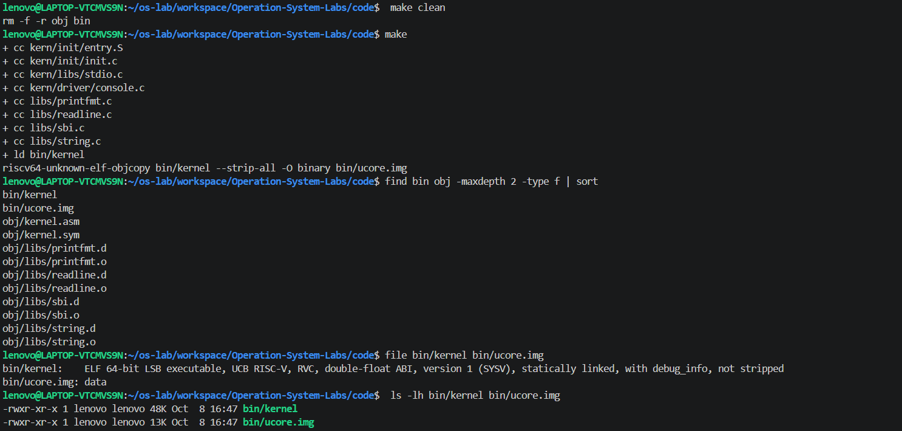
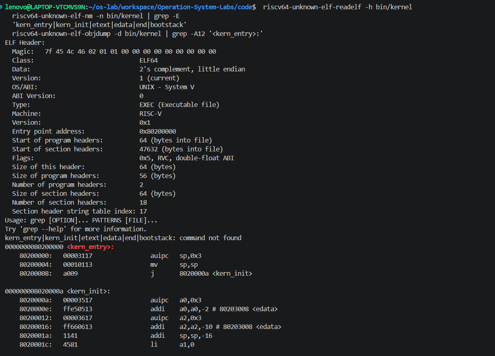
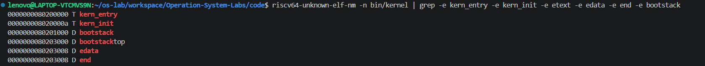
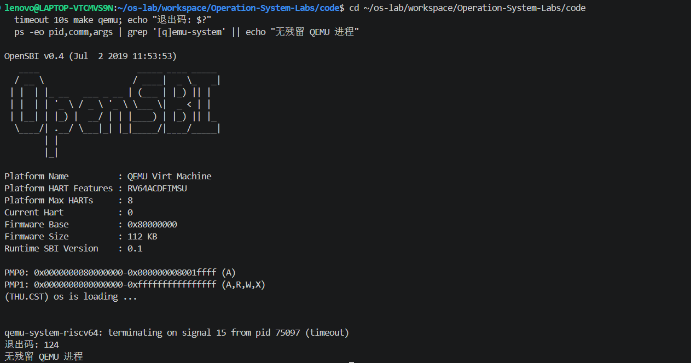
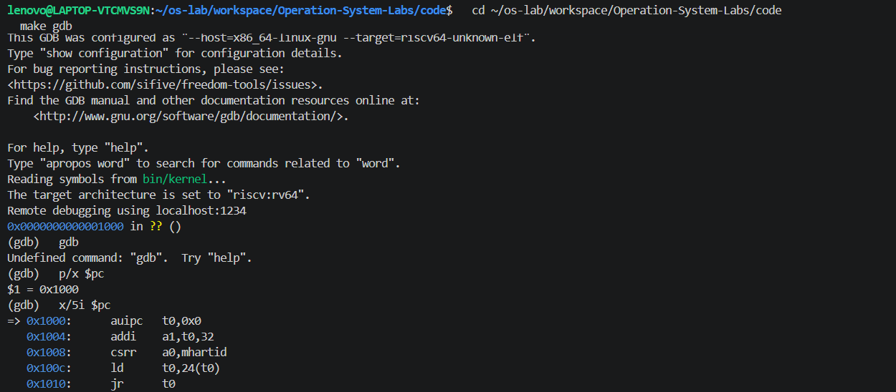
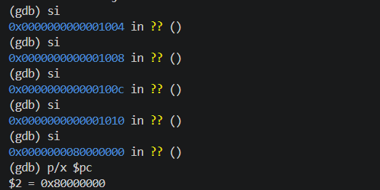
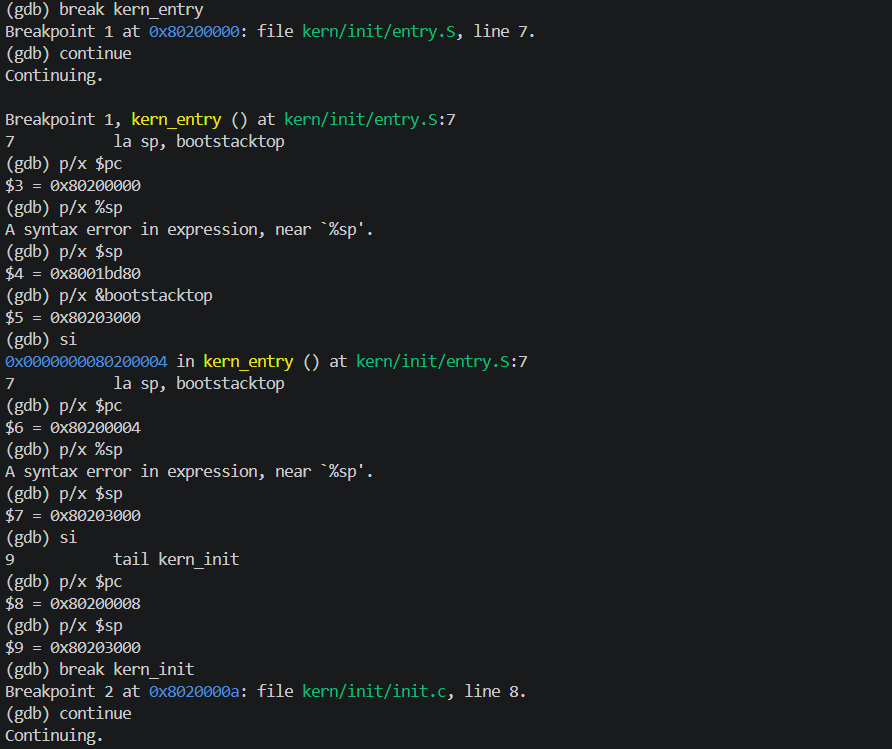
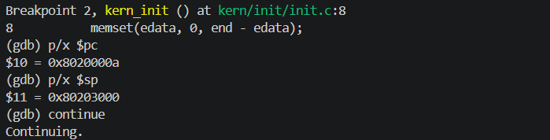

# 操作系统实验报告：Lab1 RISC-V 启动流程

## 实验基本信息

| 项目 | 内容 |
|---|---|
| 实验名称 | Lab1：RISC-V 内核启动与调试 |
| 小组成员 | 甘文杰 2412700、王子楸 2412712、向宇航 2413318 |
| 完成日期 | 2026-10-07 至 2026-10-08 |
| 仓库分支 | `work/lab1/wenjie` |
| 实验记录 | `report/_work/`（学习笔记与执行记录随仓库提交；`logs/` 原始终端日志仅本地保留） |

### 小组分工

| 成员 | 学号 | 本次 Lab1 分工 |
|---|---|---|
| 甘文杰 | 2412700 | 在 `work/lab1/wenjie` 分支完成 Lab1 启动验证（构建、静态检查、QEMU 运行、GDB 启动链跟踪）并整理记录 |
| 王子楸 | 2412712 | 前期环境搭建（RISC-V 工具链与 QEMU 安装、PATH 配置）、项目流程与相关知识梳理 |
| 向宇航 | 2413318 | 复核完成过程有无问题、独立二次复现、报告整理 |

## 一、实验目的

1. 从 Makefile、链接脚本、汇编入口和 C 初始化代码中梳理 ucore 的启动路径。
2. 使用课程指定的 RISC-V 工具链进行干净构建，并通过 ELF 头、链接符号和反汇编确认内核入口与栈的位置。
3. 在 QEMU 中验证 OpenSBI 能否把控制权交给内核，并用 GDB 动态观察复位地址、内核入口、栈设置和 `kern_init`。
4. 保留每一步的目的、命令、结果和偏差，便于复现实验及讲解。

## 二、实验环境

### 首次运行环境

| 项目 | 实际环境 |
|---|---|
| 主机环境 | Ubuntu 22.04.5 LTS，运行于 WSL2；x86_64，16 个可用处理器 |
| GNU Make | 4.3 |
| RISC-V GCC | `riscv64-unknown-elf-gcc` 10.2.0 |
| RISC-V GDB | `riscv64-unknown-elf-gdb` 10.1.0 |
| QEMU | `qemu-system-riscv64` 4.1.1 |
| 工具安装位置 | `~/os-lab/toolchain/current`、`~/os-lab/qemu/current` |
| 实验代码目录 | `Operation-System-Labs/code/` |
| AI 工具 | Codex、Claude Code（deepseek-flash） |

GDB 通过 `localhost:1234` 连接 QEMU。

### 复现环境

| 项目 | 实际环境 |
|---|---|
| 主机环境 | Ubuntu 24.04.5.1 LTS，运行于 Vmware Workstation；x86_64，1 个可用处理器 |
| GNU Make | 4.3 |
| RISC-V GCC | `riscv64-unknown-elf-gcc` 13.2.0 |
| RISC-V GDB | 使用更新的 `gdb-multiarch` 15.1 软连接为 `riscv64-unknown-elf-gdb` |
| QEMU | `qemu-system-riscv64` 8.2.2 |
| 工具安装位置 | 所有工具直接使用 `apt` 安装，均为默认安装位置 |
| 实验代码目录 | `Operation-System-Labs/code/` |
| AI 工具 | Codex |

> 安装工具原始命令
> ```bash
> sudo apt update
> sudo apt install build-essential git \
>   gcc-riscv64-unknown-elf binutils-riscv64-unknown-elf \
>   qemu-system-misc gdb-multiarch
> ```
> 软连接 gdb-multiarch 为 riscv64-unknown-elf-gdb
> ```bash
> sudo ln -s /usr/bin/gdb-multiarch /usr/local/bin/riscv64-unknown-elf-gdb
> ```


## 三、实验整体逻辑分析

本实验追踪的是从 QEMU 上电到 ucore C 初始化函数的控制流：

```text
QEMU reset ROM 0x1000
        ↓
OpenSBI firmware 0x80000000
        ↓（QEMU loader 已将 ucore.img 放到 0x80200000）
ucore 入口 kern_entry 0x80200000
        ↓
设置 sp = bootstacktop = 0x80203000
        ↓
kern_init 0x8020000a
        ↓
调用 cprintf，经 SBI 输出启动信息并保持运行
```

OpenSBI 的工作可以概括为加载并启动内核；结合本次 `Makefile` 的具体配置，`-device loader,file=...,addr=0x80200000` 会由 QEMU 在执行前把 `ucore.img` 放到内存中，OpenSBI 完成固件初始化后再把控制权交给内核。`debug` 目标还使用 `-s -S` 开启 GDB stub 并暂停 CPU；GDB 读取 `bin/kernel` 中的 ELF 符号来定位 `kern_entry` 和 `kern_init`。

链接脚本 `code/tools/kernel.ld` 把 `kern_entry` 设为 ELF 入口，并从 `0x80200000` 开始布局。`code/kern/init/entry.S` 设置内核栈后跳到 `kern_init`。`kern_init` 调用 `memset(edata, 0, end - edata)`，再输出 `(THU.CST) os is loading ...` 并进入无限循环。

### 关键函数与模块

| 文件或函数 | 在本实验中的作用 |
|---|---|
| `tools/kernel.ld` | 指定 ELF 入口 `kern_entry` 和内核基址 `0x80200000`，安排各 section，并提供 `edata`、`end` 等链接符号。 |
| `kern/init/entry.S:kern_entry` | 将 `sp` 设为 `bootstacktop`，再通过 `tail kern_init` 转入 C 初始化函数。 |
| `kern/init/init.c:kern_init` | 尝试清零 `[edata, end)`，调用 `cprintf` 输出启动信息，之后停在循环中。 |
| `kern/libs/stdio.c:cprintf`、`libs/printfmt.c:vprintfmt` | 解析格式字符串并逐字符输出，提供内核自己的格式化输出。 |
| `kern/driver/console.c:cons_putc`、`libs/sbi.c:sbi_call` | 将字符输出请求转成 SBI 调用，把服务号放入 `x17`、参数放入 `x10` 至 `x12`，再通过 `ecall` 请求 OpenSBI 提供控制台服务。 |
| `Makefile` 的 `qemu`、`debug`、`gdb` 目标 | 分别构建并启动 QEMU、暂停目标供调试，以及加载 ELF 符号后连接 GDB。 |

因此，启动信息的调用路径是 `cprintf → vprintfmt → cons_putc → sbi_console_putchar → sbi_call → ecall`,从而实现让内核通过 OpenSBI 提供的接口输出字符。

## 四、实验内容与实现

### 4.1 干净构建与静态检查

**目的：** 先删除构建输出再编译，以确认结果来自当前源码；随后检查 ELF 架构、入口地址和符号，并用反汇编解释汇编伪指令实际生成的指令。

**命令：** 在 `code/` 目录依次运行 `make clean`、`make`，再运行 `file`、`readelf -h`、`nm -n` 和 `objdump -d` 检查产物。

| 检查内容 | 结果 |
|---|---|
| 构建 | 退出码 0；生成 `bin/kernel` 和 `bin/ucore.img` |
| ELF 类型/架构 | 静态 ELF64 RISC-V executable；raw 镜像为 data |
| ELF 入口 | `0x80200000` |
| 关键符号 | `kern_entry=0x80200000`；`kern_init=0x8020000a`；`bootstack=0x80201000`；`bootstacktop=0x80203000`；`edata=end=0x80203008` |
| 入口反汇编 | `la sp, bootstacktop` 展开为 `auipc` 和 `mv`；`tail kern_init` 跳转到 `0x8020000a` |

`edata` 和 `end` 相等，说明本次链接结果中 `[edata, end)` 长度为 0；`kern_init` 中的 `memset` 调用没有清除任何字节。ELF 保留符号和调试信息，供 GDB 定位函数；`ucore.img` 是供 QEMU loader 使用的裸镜像。链接脚本的起始地址与 Makefile 的加载地址均为 `0x80200000`，两者一致。



*图 01：`make clean && make` 的完整输出，含 8 条 `+ cc`、`+ ld bin/kernel` 与 objcopy 生成裸镜像；下方 `file` 输出显示 `bin/kernel` 为 ELF 而 `bin/ucore.img` 为 data。*



*图 02：`readelf -h` 显示 `Entry point address: 0x80200000`、`Machine: RISC-V`；`objdump -d` 显示 `kern_entry` 展开为 `auipc sp,0x3` 与 `mv sp,sp`，`tail kern_init` 跳转到 `0x8020000a`。*



*图 03：`nm -n` 的关键符号地址——`kern_entry=0x80200000`、`kern_init=0x8020000a`、`bootstack=0x80201000`、`bootstacktop=0x80203000`、`edata=end=0x80203008`。*

### 4.2 普通 QEMU 启动

**目的：** 不连接 GDB，先确认默认 OpenSBI 固件和内核可以在 QEMU 中完成启动。

**命令：** `timeout 10s make qemu`。命令在 10 秒后返回 124，因为 `kern_init` 按设计进入无限循环；判定启动结果时检查控制台输出和遗留进程。

**结果：** 控制台先输出 OpenSBI v0.4 和 QEMU virt 平台信息，再输出 `(THU.CST) os is loading ...`。超时后无残留 QEMU 进程。最终复跑也观察到相同输出。



### 4.3 GDB 启动链与栈检查

**目的：** 在运行时确认 reset ROM、OpenSBI、内核汇编入口及 C 初始化函数的地址顺序，并直接验证 `kern_entry` 设置的栈值。

**方法：** 终端 A 运行 `make debug`，终端 B 运行 `make gdb` 连接 `localhost:1234`。GDB 从复位地址单步五次，再在 `kern_entry` 和 `kern_init` 设置断点；在入口处逐条执行栈设置指令并检查 `sp`。最终复跑的命令和输出保存在 `report/_work/logs/52` 至 `55` 号文件中。

| GDB 停点/动作 | 观测结果 | 解释 |
|---|---|---|
| 初始 PC | `0x1000` | QEMU reset ROM 起点 |
| 对 reset ROM 单步 5 次 | `PC=0x80000000` | 执行流到达 OpenSBI 固件入口 |
| 命中 `kern_entry` | `PC=0x80200000` | 固件已将控制权交给 ucore |
| 执行栈设置第一条指令之前 | `sp=0x8001bd80`，`bootstacktop=0x80203000` | 此时 SP 仍是 OpenSBI 栈地址 |
| 单步执行 `auipc sp,0x3` 后 | `PC=0x80200004`，`sp=0x80203000` | SP 已设置为内核栈顶；GDB 相等断言通过 |
| 再执行第二条指令 | `PC=0x80200008`，`sp=0x80203000` | SP 保持正确，下一条跳转到 C 初始化入口 |
| 命中 `kern_init` | `PC=0x8020000a`，`sp=0x80203000` | PC 与函数符号一致，栈指针仍等于 `bootstacktop`；GDB 入口断言通过 |

GDB 脱离后让目标继续运行，QEMU 串口仍输出 ucore 启动信息。结束时检查无 QEMU 进程，`localhost:1234` 端口已关闭。



*图 05：GDB 连接 `localhost:1234` 后初始 `PC = 0x1000`，并列出 reset ROM 的 5 条指令。*



*图 06：在 reset ROM 上单步 5 次，PC 依次经过 `0x1004`→`0x1008`→`0x100c`→`0x1010` 到达 `0x80000000`，进入 OpenSBI 固件区域。*



*图 07：命中 `kern_entry`（`PC=0x80200000`）时 `sp=0x8001bd80`，`&bootstacktop=0x80203000`；执行第一条指令 `auipc sp,0x3` 后 `sp=0x80203000`，与 `bootstacktop` 相等，断言成立。*



*图 08：继续后在 `kern_init` 命中，`PC=0x8020000a`，`sp` 仍为 `0x80203000`；继续运行后串口输出启动信息。*

### 4.4 练习题

#### 练习 1：理解内核启动中的程序入口操作

`la sp, bootstacktop` 把符号 `bootstacktop` 的地址放入栈指针 `sp`。它取得的是地址本身，不是读取该地址处的内容。当前反汇编将它展开为 `auipc sp,0x3` 和 `mv sp,sp`；执行第一条后 `sp` 已为 `0x80203000`，第二条没有改变这个值。

`entry.S` 在 `.data` 中通过 `.space KSTACKSIZE` 预留内核栈。`KSTACKSIZE` 为两页，即 `2 × 4096 = 8192` 字节；符号地址为 `bootstack=0x80201000`、`bootstacktop=0x80203000`。RISC-V 栈向低地址增长，所以入口把 `sp` 指向栈的高地址边界。这样进入 C 函数前就有了可用的内核栈，函数调用和局部变量才能正常使用栈空间。

`tail kern_init` 是尾跳转伪指令，用来把控制流交给 `kern_init`。本次反汇编显示为跳到 `0x8020000a` 的 `j` 指令。它不像普通函数调用那样保存一个返回地址；`kern_init` 被声明为 `noreturn`，入口函数也不需要在初始化后恢复执行，因此直接跳转即可。

#### 练习 2：使用 GDB 验证启动流程

终端 A 用 `make debug` 启动带有 `-s -S` 的 QEMU，终端 B 用 `make gdb` 连接。GDB 初始读到 `PC=0x1000`，用 `x/5i $pc` 查看复位代码，再执行五次 `si`；PC 到达 `0x80000000`。随后在 `kern_entry` 设置断点并继续运行，确认 PC 到达 `0x80200000`，即执行内核第一条指令。实验中还继续单步检查栈设置，并在 `kern_init` 断点确认 C 入口地址。

本次复位 ROM 的指令及作用如下：

| 地址 | 指令 | 作用 |
|---|---|---|
| `0x1000` | `auipc t0,0x0` | 取得当前 PC 附近的地址基准，供后续访问复位数据。 |
| `0x1004` | `addi a1,t0,32` | 将设备树数据地址 `0x1020` 放入 `a1`，作为启动参数。 |
| `0x1008` | `csrr a0,mhartid` | 读取当前 hart ID，放入 `a0`。 |
| `0x100c` | `ld t0,24(t0)` | 从 `0x1018` 读取下一阶段的入口地址。 |
| `0x1010` | `jr t0` | 跳转到读取出的地址；本次运行到达 OpenSBI 的 `0x80000000`。 |

GDB 的观察结果与启动顺序一致：`0x1000 → 0x80000000 → 0x80200000`。前五条指令属于本次 QEMU `virt` 机器提供的复位代码，负责准备启动参数并把控制权交给 OpenSBI；OpenSBI 初始化后再进入已由 QEMU loader 放在 `0x80200000` 的内核。`0x1000` 是当前模拟平台的复位入口，其他 RISC-V 实现可能使用不同地址。

### 4.5 AI 协作与迭代记录

本次以 Starter Code 验证和报告整理为主，没有修改课程源码。实际使用过的提示词记录在 `report/prompt.md`；学习过程和实验步骤记录在 `report/_work/execution-log.md`。原始终端日志保存在 `report/_work/logs/`，不纳入提交。

## 五、实验知识点与操作系统原理

| 本实验中的知识点 | 对应的操作系统原理 | 含义、联系和差异 |
|---|---|---|
| 复位入口、固件与内核交接 | 引导过程分阶段完成平台初始化和内核启动 | 本次从 QEMU `virt` 的 `0x1000` 复位代码进入 OpenSBI，再进入 ucore；`0x1000` 是当前模拟平台的地址，不能推广到所有 RISC-V 实现。 |
| 链接脚本与加载地址 | 内核按链接时确定的内存布局运行，加载器负责把镜像放到对应位置 | 本次 `kernel.ld` 和 QEMU loader 都使用 `0x80200000`。由于没有启用分页，这里的运行地址与装载物理地址相同；启用分页后，虚拟地址和物理地址可以不同。 |
| ELF 与裸镜像 | ELF 描述程序入口、段和符号，裸镜像只保留供装载的连续内容 | GDB 使用保留符号的 `bin/kernel`；QEMU loader 加载 `bin/ucore.img`。两者来自同一内核，服务于调试和运行的不同环节。 |
| 栈指针与函数调用 | 内核进入 C 代码前需要建立符合调用约定的栈 | 栈是预留的内存区域，`sp` 是运行时指向栈顶的寄存器；本次入口把它设为 `0x80203000`，栈向低地址增长。 |
| BSS 初始化 | 未初始化的全局/静态数据在启动时需要置零 | 代码调用 `memset(edata, 0, end - edata)`；本次 `edata=end`，长度为 0，所以虽然保留了初始化步骤，实际没有清零字节。 |
| SBI 与控制台输出 | 内核通过固件接口请求底层服务 | `cprintf` 最终通过 `ecall` 请求 OpenSBI 输出字符。SBI 是内核与固件之间的接口，和用户程序通过系统调用请求内核服务处在不同层次。 |

## 六、测试与验证

下表"证据"列引用的是本次实验的原始日志文件名。完整日志保存在工作区 `report/_work/logs/`，属于过程记录。

| 验证项目 | 结果 | 证据 |
|---|---|---|
| `make clean && make` | 通过，退出码 0 | `_work/logs/48-lab1-final-clean-build-static.log` |
| ELF 架构、入口和符号 | 通过：RISC-V，入口 `0x80200000` | 同上；初次静态检查见 `_work/logs/35-lab1-static-verify.log` |
| 普通 QEMU 启动 | 通过；出现 ucore 启动信息，超时码 124 符合预期 | `_work/logs/50-lab1-final-qemu-output.log`、`_work/logs/51-lab1-final-qemu-check.log` |
| GDB 地址链、栈和 C 入口 | 通过；两项 GDB 断言均通过 | `_work/logs/54-lab1-final-replay-gdb.log`、`_work/logs/55-lab1-final-replay-cleanup.log` |
| `make grade` | 未运行 | Makefile 的 `grade` 目标会调用缺失的 `tools/grade.sh`，因此没有运行该目标 |

### 实验截图

`report/images/` 中保存了 8 张真实终端截图，按实验顺序编号，全部为实际终端/调试器画面。

命名约定：统一使用**两位数字前缀 + 语义名**。

| 文件名 | 截图内容 | 对应小节 |
|---|---|---|
| `01-build-success.png` | `make clean` 和 `make` 成功输出 | 4.2 |
| `02-static-elf-entry.png` | `readelf -h` 入口地址与 `kern_entry` 反汇编 | 4.2 |
| `03-static-elf-symbols.png` | `nm -n` 关键符号地址 | 4.2 |
| `04-qemu-start.png` | OpenSBI v0.4 横幅与 ucore 启动信息 | 4.3 |
| `05-gdb-reset-vector.png` | GDB 初始 PC `0x1000` 及 reset ROM 反汇编 | 4.4 |
| `06-gdb-opensbi.png` | PC 到达固件区域 `0x80000000` | 4.4 |
| `07-gdb-kernel-entry.png` | `kern_entry`、`sp` 切换为 `bootstacktop=0x80203000` | 4.4 |
| `08-gdb-kern-init.png` | 命中 `kern_init`，`PC=0x8020000a` | 4.4 |

## 七、实验总结与收获

### 对操作系统启动过程的理解

1. 固件入口和内核入口是两个不同阶段：本次 QEMU 从 `0x1000` 的复位代码开始，然后到 OpenSBI 的 `0x80000000`，再跳入加载在 `0x80200000` 的 ucore。
2. 内核入口汇编先建立自己的栈，再进入 C 函数。若过早使用 C 运行时而没有有效栈，函数调用和局部状态都无法可靠工作。本次 GDB 直接观察到 `sp` 从 OpenSBI 地址变为 `bootstacktop`。
3. ELF 和裸镜像用途不同：ELF 保留入口、符号及调试信息，QEMU loader 加载 raw `ucore.img`。链接脚本与加载地址需要匹配。
4. 内核通过 SBI 请求 OpenSBI 输出字符。本次只验证了启动和控制台输出，没有实现完整操作系统的中断、内存管理或进程调度。

